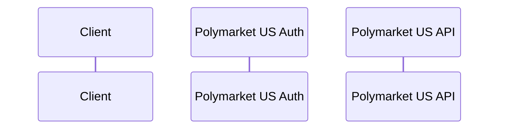

# Polymarket Exchange Partner Docs

> **GitHub Account**: This repo uses the `chrisrodier-beep` account (default `gh auth`).
> No special token needed - uses default gh CLI authentication.

Mintlify documentation site for the Polymarket Exchange API.

## Publishing Setup

**TEMPORARY**: Documentation is published from Chris's personal repo:
- **Remote name:** `personal`
- **Repo:** `git@github-polymarket:chrisr-a11y/docs.git`
- **Branch:** `main`
- **Mintlify URL:** https://polymarket-7725624a.mintlify.app

**Publishing workflow:**
```bash
# From go-exchange-gateway-us, sync swagger schemas:
python3 scripts/sync-swagger-to-docs.py

# Commit and push from website-dcm-docs:
cd ../website-dcm-docs
git add .
git commit -m "docs: Update API schemas"
git push personal main
```

The org repo (`origin` = Polymarket-US/website-dcm-docs) is NOT currently used for Mintlify publishing.

## API Documentation Structure

**REST API Tab** (uses OpenAPI schemas from `api-reference/oapi-schemas/`):
- Health - Service health check
- Accounts - User/account management
- Trading - Insert/cancel orders (OrderEntryAPI)
- Orders - Search orders/trades (OrderAPI)
- Positions - Balances and positions (REST only, not subscriptions)
- Reference Data - Instruments and symbols (RefDataAPI)
- Order Book - L2 snapshots, BBO
- KYC - Identity verification
- Payments - Aeropay, Checkout.com, Funding

**Connect API Tab** - Streaming endpoints via Connect protocol:
- Market Data Subscription
- Order Subscription
- Position Subscription
- Drop Copy (all 4 endpoints)

**gRPC API Tab** - Same streaming as Connect, but via gRPC

**FIX API Tab** - FIX protocol documentation

## Diagram Naming Convention

In mermaid sequence diagrams, use these participant names consistently:
- `Auth as Polymarket US Auth` - Authentication service
- `API as Polymarket US API` - API service
- `P as Polymarket US` - Short form when space is limited

Example:


Do NOT use "Gateway" or other internal names in public documentation.

## URL Path Convention

The REST API uses `/v1/` paths (RESTful style):
- `/v1/trading/orders` - Insert order
- `/v1/trading/orders/cancel` - Cancel order
- `/v1/orders/search` - Search orders
- `/v1/refdata/instruments` - List instruments

Legacy `/v1beta1/` paths are supported for backwards compatibility but NOT documented.

## MDX Syntax Restrictions

Mintlify uses MDX (Markdown + JSX). Avoid these characters that break parsing:

**Do NOT use:**
- Curly braces `{ }` outside code blocks - interpreted as JSX expressions
- Angle brackets `< >` in text - interpreted as HTML/JSX tags
- Checkbox characters `☐ ☑` - cause parsing errors
- Other special Unicode symbols that may conflict with JSX

**Instead use:**
- Square brackets `[ ]` for placeholders: `[companyname]` not `{companyname}`
- Words for ranges: `Under $1M` not `<$1M`, `Over $100M` not `>$100M`
- Markdown checkboxes: `- [ ]` in lists, or just leave blank fields in tables

**Test locally before pushing:**
```bash
npx mintlify dev
```
Watch for "parsing error" messages in the terminal output.

