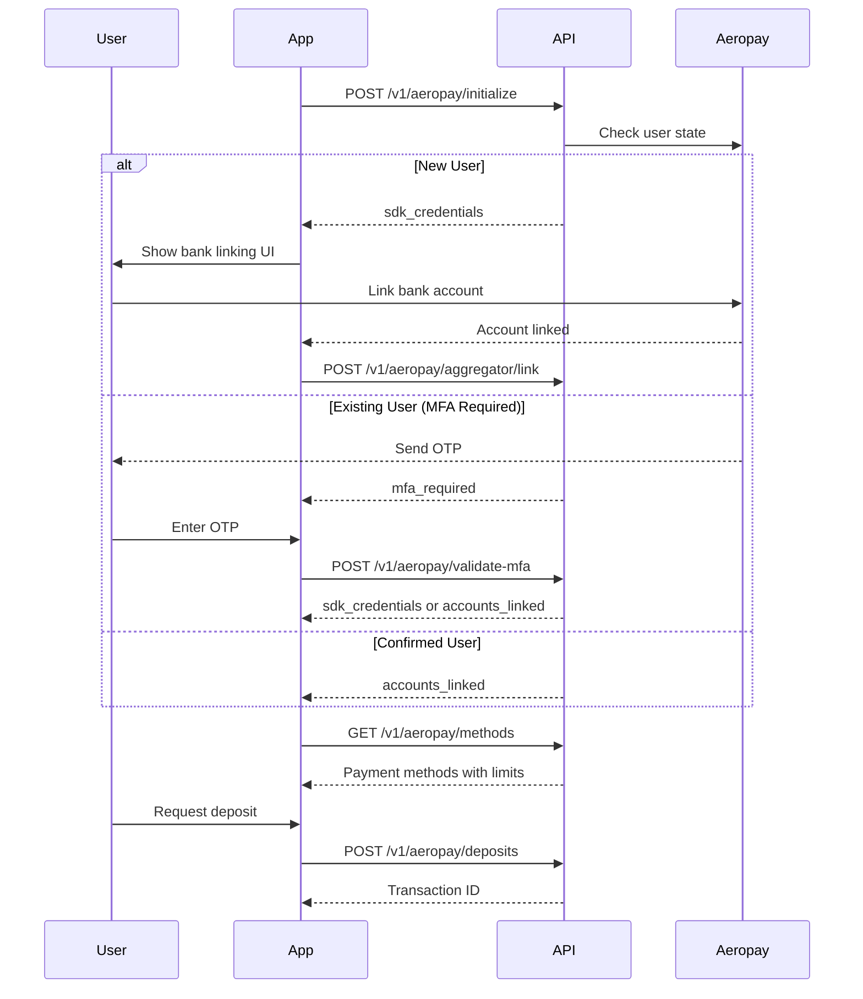

# Aeropay Integration

Aeropay enables users to link their bank accounts and make ACH transfers for deposits and withdrawals.

## Endpoints Overview

### Orchestrated Endpoints (Recommended)

| Method | Endpoint | Description |
|--------|----------|-------------|
| `POST` | `/v1/aeropay/initialize` | Start bank linking - handles user creation and MFA automatically |
| `POST` | `/v1/aeropay/validate-mfa` | Submit MFA code if required |
| `GET` | `/v1/aeropay/methods` | List payment methods with limits and FIFO rules |
| `POST` | `/v1/aeropay/deposits` | Create ACH deposit |
| `POST` | `/v1/aeropay/withdrawals` | Create ACH withdrawal |

### Primitive Endpoints (Advanced)

| Method | Endpoint | Description |
|--------|----------|-------------|
| `POST` | `/v1/aeropay/users` | Create Aeropay user |
| `POST` | `/v1/aeropay/users/confirm` | Confirm user with OTP |
| `POST` | `/v1/aeropay/aggregator/credentials` | Get bank aggregator credentials |
| `POST` | `/v1/aeropay/aggregator/link` | Link bank account |
| `POST` | `/v1/aeropay/funding-sources/enable` | Enable funding source |

---

## Quick Start (Recommended)

The orchestrated flow handles user creation, MFA, and state management automatically. This is the recommended integration path for most use cases.

### Integration Flow



### Step 1: Initialize Aeropay

Start the integration by calling initialize. This endpoint handles user creation and MFA triggering automatically.

#### Request

```bash
POST /v1/aeropay/initialize
```

```json
{
  "fundingAccountId": "fa_123",
  "userProfile": {
    "firstName": "John",
    "lastName": "Doe",
    "email": "john.doe@example.com",
    "phoneNumber": "+15551234567"
  }
}
```

#### Response Types

The response contains **one of three possible outcomes**:

**1. MFA Required** (existing user needs verification)

```json
{
  "fundingAccountId": "fa_123",
  "aeropayMfaRequired": {
    "aeropayUserId": "aero_user_123",
    "phone": "+1***1234",
    "email": "j***@example.com",
    "displayMessage": "Please enter the verification code sent to your phone."
  }
}
```

When you receive `aeropayMfaRequired`:
- Display the `displayMessage` to the user
- Collect the 6-digit OTP code
- Call `/v1/aeropay/validate-mfa`

**2. SDK Credentials** (new user ready to link bank)

```json
{
  "fundingAccountId": "fa_123",
  "aeropaySDKCredentials": {
    "fastLinkUrl": "https://fastlink.yodlee.com/...",
    "token": "jwt_token_xyz",
    "username": "aeropay_user_123"
  }
}
```

When you receive `aeropaySDKCredentials`:
- Launch the Yodlee FastLink SDK with these credentials
- After user links their bank, call `/v1/aeropay/aggregator/link`

**3. Accounts Linked** (confirmed user with existing banks)

```json
{
  "fundingAccountId": "fa_123",
  "aeropayAccountsLinked": {
    "aeropayUserId": "aero_user_123",
    "paymentMethods": [
      {
        "id": "pm_123",
        "bankName": "Chase Bank",
        "accountLast4": "4567",
        "accountType": "checking",
        "status": "active",
        "isDefault": true
      }
    ]
  }
}
```

When you receive `aeropayAccountsLinked`:
- User is ready to make deposits/withdrawals
- Display their linked accounts
- Proceed to deposit/withdrawal flow

### Step 2: Validate MFA (if required)

If initialize returned `aeropayMfaRequired`, submit the OTP code.

#### Request

```bash
POST /v1/aeropay/validate-mfa
```

```json
{
  "fundingAccountId": "fa_123",
  "aeropayUserId": "aero_user_123",
  "mfaCode": "123456"
}
```

#### Response

Returns either `aeropaySDKCredentials` (if user needs to link bank) or `aeropayAccountsLinked` (if user has existing banks):

```json
{
  "fundingAccountId": "fa_123",
  "aeropaySDKCredentials": {
    "fastLinkUrl": "https://fastlink.yodlee.com/...",
    "token": "jwt_token_xyz",
    "username": "aeropay_user_123"
  }
}
```

### Step 3: Link Bank Account (via SDK)

After receiving SDK credentials, launch the Yodlee FastLink UI. When the user completes bank linking, call the link endpoint.

#### Request

```bash
POST /v1/aeropay/aggregator/link
```

```json
{
  "aeropayUserId": "aero_user_123",
  "aggregatorUserId": "yodlee_user_id",
  "aggregatorUserPassword": "yodlee_token",
  "fundingAccountId": "fa_123"
}
```

#### Response

```json
{
  "userBankInfo": {
    "bankAccountId": "ba_123",
    "userId": "aero_user_123",
    "bankName": "Chase Bank",
    "accountLast4": "4567",
    "name": "John's Checking",
    "accountType": "checking",
    "status": "active",
    "createdDate": "2024-01-15T10:35:00Z"
  }
}
```

### Step 4: Get Payment Methods

Retrieve linked payment methods with deposit limits and withdrawal requirements.

#### Request

```bash
GET /v1/aeropay/methods?fundingAccountId=fa_123
```

#### Response

```json
{
  "paymentMethods": [
    {
      "id": "pm_123",
      "bankName": "Chase Bank",
      "accountLast4": "4567",
      "accountType": "checking",
      "status": "active",
      "isDefault": true,
      "depositLimits": {
        "currency": "USD",
        "maxPerTransaction": "10000.00",
        "maxDaily": "25000.00",
        "max60Day": "100000.00"
      },
      "withdrawalRequirements": [
        {
          "amount": "500.00",
          "currency": "USD",
          "fundingSourceId": "fs_abc123",
          "description": "Must withdraw to original deposit source (FIFO)"
        }
      ]
    }
  ]
}
```

### Step 5: Create Deposit

Initiate an ACH deposit from a linked bank account.

#### Request

```bash
POST /v1/aeropay/deposits
```

```json
{
  "userId": "aero_user_123",
  "bankAccountId": "ba_123",
  "amount": "100.00",
  "currency": "USD",
  "description": "Account funding",
  "fundingAccountId": "fa_123",
  "fundingSourceId": "fs_abc123"
}
```

#### Response

```json
{
  "fundingTransactionId": "ft_deposit_123",
  "aeropayUuid": "aero_txn_abc"
}
```

### Step 6: Create Withdrawal

Initiate an ACH withdrawal to the user's bank account.

#### Request

```bash
POST /v1/aeropay/withdrawals
```

```json
{
  "userId": "aero_user_123",
  "bankAccountId": "ba_123",
  "amount": "50.00",
  "currency": "USD",
  "description": "Withdrawal to bank",
  "fundingAccountId": "fa_123",
  "fundingSourceId": "fs_abc123"
}
```

#### Response

```json
{
  "fundingTransactionId": "ft_withdraw_456",
  "aeropayUuid": "aero_txn_def"
}
```

---

## FIFO Withdrawal Requirements

Withdrawals must follow **FIFO (First-In-First-Out) rules**. This means funds must be returned to the original deposit source before they can be withdrawn elsewhere.

### How It Works

1. User deposits $1,000 from Bank Account A
2. User deposits $500 from Bank Account B
3. User wants to withdraw $800

**Withdrawal must be split:**
- $500 to Bank Account B (most recent deposit)
- $300 to Bank Account A

### Checking Requirements

The `GetAeropayMethods` response includes `withdrawalRequirements` for each payment method:

```json
{
  "withdrawalRequirements": [
    {
      "amount": "500.00",
      "currency": "USD",
      "fundingSourceId": "fs_bank_b",
      "description": "Must withdraw to original deposit source"
    }
  ]
}
```

**Best Practice:** Check withdrawal requirements before displaying withdrawal options to users.

---

## ACH Processing Times

| Transaction Type | Processing Time |
|-----------------|-----------------|
| Deposit | 1-3 business days |
| Withdrawal | 1-3 business days |

---

## Error Handling

| Error | Description | Resolution |
|-------|-------------|------------|
| `INSUFFICIENT_FUNDS` | Bank account has insufficient balance | User needs to add funds to bank |
| `ACCOUNT_NOT_VERIFIED` | Bank account verification incomplete | Complete micro-deposit verification |
| `USER_NOT_CONFIRMED` | Aeropay user not confirmed | Complete MFA verification |
| `INVALID_MFA_CODE` | Incorrect OTP entered | User should re-enter or request new OTP |
| `MFA_EXPIRED` | OTP has expired | Restart the flow with initialize |
| `RATE_LIMIT_EXCEEDED` | Too many requests | Implement backoff and retry |
| `LIMIT_EXCEEDED` | Deposit/withdrawal exceeds limits | Check limits via GetAeropayMethods |

---

## Advanced: Primitive Endpoints

For fine-grained control over the Aeropay integration, you can use the primitive endpoints directly instead of the orchestrated flow.

<Accordion title="Primitive Endpoint Documentation">

### Create Aeropay User

Register the user with Aeropay.

```bash
POST /v1/aeropay/users
```

```json
{
  "firstName": "John",
  "lastName": "Doe",
  "phoneNumber": "+15551234567",
  "email": "john.doe@example.com",
  "fundingAccountId": "fa_123"
}
```

**Response:**

```json
{
  "user": {
    "userId": "aero_user_123",
    "aeroPassUserUuid": "uuid_abc",
    "firstName": "John",
    "lastName": "Doe",
    "type": "individual",
    "email": "john.doe@example.com",
    "phone": "+15551234567",
    "bankAccounts": [],
    "createdDate": "2024-01-15T10:30:00Z"
  },
  "requiresConfirmation": true,
  "displayMessage": "Please enter the verification code sent to your phone."
}
```

### Confirm Aeropay User

If `requiresConfirmation` is true, submit the OTP.

```bash
POST /v1/aeropay/users/confirm
```

```json
{
  "userId": "aero_user_123",
  "code": "123456",
  "fundingAccountId": "fa_123"
}
```

**Response:**

```json
{
  "user": {
    "userId": "aero_user_123",
    ...
  },
  "fundingSourceIds": ["fs_abc123"]
}
```

### Get Aggregator Credentials

Get credentials for the bank linking UI.

```bash
POST /v1/aeropay/aggregator/credentials
```

```json
{
  "userId": "aero_user_123",
  "fundingAccountId": "fa_123"
}
```

**Response:**

```json
{
  "fastLinkUrl": "https://fastlink.yodlee.com/...",
  "username": "user_abc",
  "token": "jwt_token_xyz"
}
```

### Enable Funding Source

Re-enable a disabled funding source.

```bash
POST /v1/aeropay/funding-sources/enable
```

```json
{
  "userId": "aero_user_123",
  "fundingSourceId": "fs_abc123",
  "fundingAccountId": "fa_123"
}
```

</Accordion>
