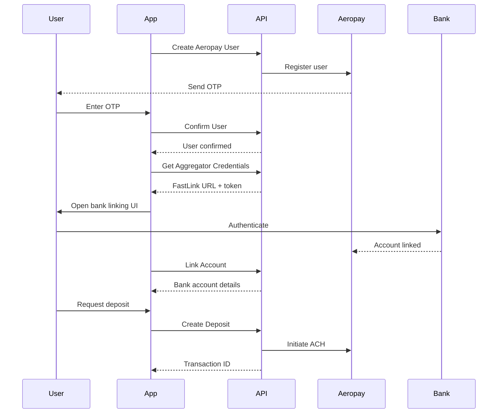

# Aeropay Integration

Aeropay enables users to link their bank accounts and make ACH transfers for deposits and withdrawals.

## Endpoints

| Method | Endpoint | Description |
|--------|----------|-------------|
| `POST` | `/v1/aeropay/users` | Create Aeropay user |
| `POST` | `/v1/aeropay/users/confirm` | Confirm user with OTP |
| `POST` | `/v1/aeropay/aggregator/credentials` | Get bank aggregator credentials |
| `POST` | `/v1/aeropay/aggregator/link` | Link bank account |
| `POST` | `/v1/aeropay/deposits` | Create ACH deposit |
| `POST` | `/v1/aeropay/withdrawals` | Create ACH withdrawal |
| `POST` | `/v1/aeropay/funding-sources/enable` | Enable funding source |

## Integration Flow



## Step 1: Create Aeropay User

Register the user with Aeropay.

### Request

```bash
POST /v1/aeropay/users
```

```json
{
  "firstName": "John",
  "lastName": "Doe",
  "phoneNumber": "+15551234567",
  "email": "john.doe@example.com",
  "fundingAccountId": "fa_123"
}
```

### Response

```json
{
  "user": {
    "userId": "aero_user_123",
    "aeroPassUserUuid": "uuid_abc",
    "firstName": "John",
    "lastName": "Doe",
    "type": "individual",
    "email": "john.doe@example.com",
    "phone": "+15551234567",
    "bankAccounts": [],
    "createdDate": "2024-01-15T10:30:00Z"
  },
  "requiresConfirmation": true,
  "displayMessage": "Please enter the verification code sent to your phone."
}
```

## Step 2: Confirm User

If `requiresConfirmation` is true, the user needs to enter the OTP sent to their phone.

### Request

```bash
POST /v1/aeropay/users/confirm
```

```json
{
  "userId": "aero_user_123",
  "code": "123456",
  "fundingAccountId": "fa_123"
}
```

### Response

```json
{
  "user": {
    "userId": "aero_user_123",
    ...
  },
  "fundingSourceIds": ["fs_abc123"]
}
```

## Step 3: Get Bank Aggregator Credentials

Get credentials for the bank linking UI (powered by Yodlee/FastLink).

### Request

```bash
POST /v1/aeropay/aggregator/credentials
```

```json
{
  "userId": "aero_user_123",
  "fundingAccountId": "fa_123"
}
```

### Response

```json
{
  "fastLinkUrl": "https://fastlink.yodlee.com/...",
  "username": "user_abc",
  "token": "jwt_token_xyz"
}
```

Use these credentials to launch the FastLink bank linking UI in your application.

## Step 4: Link Bank Account

After the user completes bank linking in FastLink, link the account to Aeropay.

### Request

```bash
POST /v1/aeropay/aggregator/link
```

```json
{
  "aeropayUserId": "aero_user_123",
  "aggregatorUserId": "yodlee_user_id",
  "aggregatorUserPassword": "yodlee_token",
  "fundingAccountId": "fa_123"
}
```

### Response

```json
{
  "userBankInfo": {
    "bankAccountId": "ba_123",
    "userId": "aero_user_123",
    "bankName": "Chase Bank",
    "accountLast4": "4567",
    "name": "John's Checking",
    "externalBankAccountId": "ext_ba_123",
    "isSelected": "true",
    "accountType": "checking",
    "status": "active",
    "createdDate": "2024-01-15T10:35:00Z"
  }
}
```

## Step 5: Create Deposit

Initiate an ACH deposit from the linked bank account.

### Request

```bash
POST /v1/aeropay/deposits
```

```json
{
  "userId": "aero_user_123",
  "bankAccountId": "ba_123",
  "amount": "100.00",
  "currency": "USD",
  "description": "Account funding",
  "fundingAccountId": "fa_123",
  "fundingSourceId": "fs_abc123"
}
```

### Response

```json
{
  "fundingTransactionId": "ft_deposit_123",
  "aeropayUuid": "aero_txn_abc"
}
```

## Step 6: Create Withdrawal

Initiate an ACH withdrawal to the user's bank account.

### Request

```bash
POST /v1/aeropay/withdrawals
```

```json
{
  "userId": "aero_user_123",
  "bankAccountId": "ba_123",
  "amount": "50.00",
  "currency": "USD",
  "description": "Withdrawal to bank",
  "fundingAccountId": "fa_123",
  "fundingSourceId": "fs_abc123"
}
```

### Response

```json
{
  "fundingTransactionId": "ft_withdraw_456",
  "aeropayUuid": "aero_txn_def"
}
```

## Enable Funding Source

Enable a funding source for use.

### Request

```bash
POST /v1/aeropay/funding-sources/enable
```

```json
{
  "userId": "aero_user_123",
  "fundingSourceId": "fs_abc123",
  "fundingAccountId": "fa_123"
}
```

## ACH Processing Times

| Transaction Type | Processing Time |
|-----------------|-----------------|
| Deposit | 1-3 business days |
| Withdrawal | 1-3 business days |

## Error Handling

| Error | Description | Resolution |
|-------|-------------|------------|
| Insufficient funds | Bank account has insufficient balance | User needs to add funds to bank |
| Account not verified | Bank account verification incomplete | Complete micro-deposit verification |
| User not confirmed | Aeropay user not confirmed | Complete OTP confirmation |
| Rate limit exceeded | Too many requests | Implement backoff and retry |
