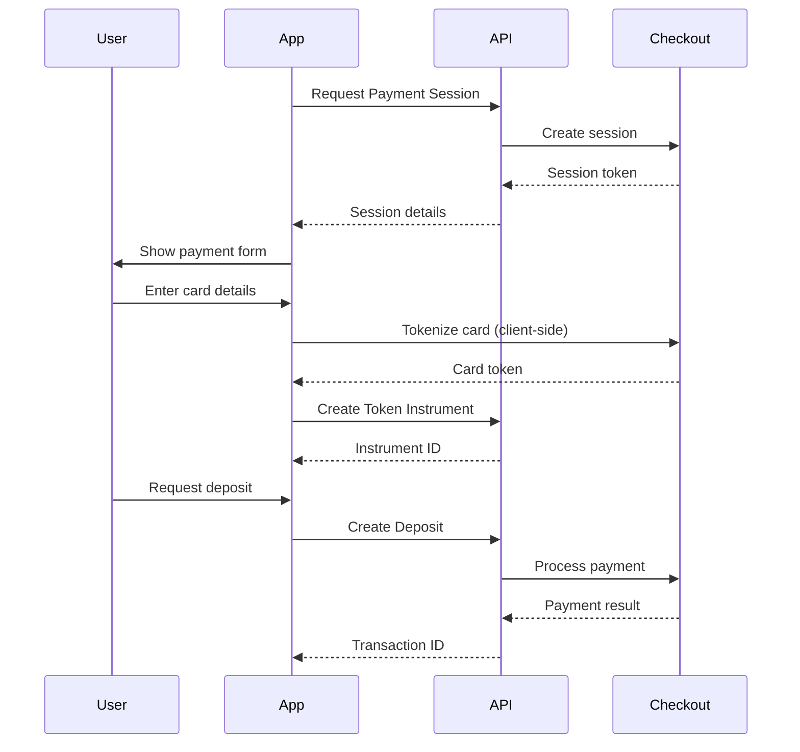

# Checkout Integration

Process card payments and Apple Pay transactions through Checkout.com.

## Endpoints

| Method | Endpoint | Description |
|--------|----------|-------------|
| `POST` | `/v1/checkout/payment-sessions` | Request payment session |
| `POST` | `/v1/checkout/instruments` | Tokenize payment card |
| `POST` | `/v1/checkout/deposits` | Create card deposit |
| `POST` | `/v1/checkout/withdrawals` | Create card withdrawal |

## Integration Flow



## Step 1: Request Payment Session

Create a payment session to initialize the Checkout.com integration.

### Request

```bash
POST /v1/checkout/payment-sessions
```

```json
{
  "fundingAccountId": "fa_123",
  "currency": "USD",
  "countryCode": "US",
  "email": "john.doe@example.com",
  "phoneNumber": "+15551234567"
}
```

### Response

```json
{
  "id": "ps_abc123",
  "paymentSessionToken": "pst_xyz",
  "paymentSessionSecret": "pss_secret",
  "links": {
    "self": {
      "href": "https://api.checkout.com/sessions/ps_abc123",
      "title": "Session"
    }
  }
}
```

Use `paymentSessionToken` and `paymentSessionSecret` to initialize the Checkout.com client-side SDK.

## Step 2: Tokenize Card

After collecting card details using the Checkout.com SDK, create a token instrument.

### Request

```bash
POST /v1/checkout/instruments
```

```json
{
  "fundingAccountId": "fa_123",
  "token": "tok_card_abc123",
  "accountHolder": {
    "type": "CHECKOUT_ACCOUNT_HOLDER_TYPE_INDIVIDUAL",
    "firstName": "John",
    "lastName": "Doe",
    "email": "john.doe@example.com",
    "phoneNumber": "+15551234567",
    "dob": "1990-01-15",
    "billingAddress": {
      "addressLine1": "123 Main St",
      "city": "New York",
      "state": "NY",
      "zip": "10001",
      "country": "US"
    }
  }
}
```

### Account Holder Types

| Type | Description |
|------|-------------|
| `CHECKOUT_ACCOUNT_HOLDER_TYPE_INDIVIDUAL` | Personal account |
| `CHECKOUT_ACCOUNT_HOLDER_TYPE_CORPORATE` | Business account |
| `CHECKOUT_ACCOUNT_HOLDER_TYPE_GOVERNMENT` | Government entity |

### Response

```json
{
  "id": "src_card_abc123"
}
```

Store the `id` as the payment instrument for future transactions.

## Step 3: Create Deposit

Process a card deposit.

### Request

```bash
POST /v1/checkout/deposits
```

```json
{
  "fundingAccountId": "fa_123",
  "amount": "10000",
  "currency": "USD",
  "description": "Account funding",
  "accountHolder": {
    "type": "CHECKOUT_ACCOUNT_HOLDER_TYPE_INDIVIDUAL",
    "firstName": "John",
    "lastName": "Doe",
    "email": "john.doe@example.com",
    "billingAddress": {
      "addressLine1": "123 Main St",
      "city": "New York",
      "state": "NY",
      "zip": "10001",
      "country": "US"
    }
  },
  "instrumentPaymentSource": {
    "instrumentId": "src_card_abc123"
  }
}
```

**Note:** Amount is in minor units (cents for USD). `10000` = $100.00

### Response

```json
{
  "fundingTransactionId": "ft_deposit_789",
  "checkoutTransactionId": "pay_abc123"
}
```

### Error Response

```json
{
  "fundingTransactionId": null,
  "checkoutTransactionId": null,
  "error": {
    "statusCode": 400,
    "status": "Bad Request",
    "requestId": "req_xyz",
    "errorType": "processing_error",
    "errorCodes": ["card_declined"]
  }
}
```

## Step 4: Create Withdrawal

Process a card withdrawal (payout).

### Request

```bash
POST /v1/checkout/withdrawals
```

```json
{
  "fundingAccountId": "fa_123",
  "amount": "5000",
  "currency": "USD",
  "description": "Withdrawal to card",
  "accountHolder": {
    "type": "CHECKOUT_ACCOUNT_HOLDER_TYPE_INDIVIDUAL",
    "firstName": "John",
    "lastName": "Doe",
    ...
  },
  "instrumentPaymentDestination": {
    "instrumentId": "src_card_abc123"
  }
}
```

### Response

```json
{
  "fundingTransactionId": "ft_withdraw_321",
  "checkoutTransactionId": "pay_def456"
}
```

## Apple Pay Integration

For Apple Pay transactions, use the Apple Pay payment details instead of instrument:

### Deposit with Apple Pay

```json
{
  "fundingAccountId": "fa_123",
  "amount": "10000",
  "currency": "USD",
  "description": "Account funding via Apple Pay",
  "accountHolder": {
    "type": "CHECKOUT_ACCOUNT_HOLDER_TYPE_INDIVIDUAL",
    "firstName": "John",
    "lastName": "Doe"
  },
  "applePayPaymentSource": {
    "version": "EC_v1",
    "data": "encrypted_payment_data",
    "signature": "signature_data",
    "headers": {
      "ephemeralPublicKey": "key_data",
      "publicKeyHash": "hash_data",
      "transactionId": "apple_txn_id"
    },
    "displayName": "Visa 1234"
  }
}
```

## Error Codes

| Error Code | Description | Resolution |
|------------|-------------|------------|
| `card_declined` | Card was declined | Try different card |
| `insufficient_funds` | Not enough funds on card | Try smaller amount |
| `expired_card` | Card has expired | Use valid card |
| `invalid_card` | Card number invalid | Check card details |
| `processing_error` | General processing error | Retry transaction |
| `velocity_limit` | Too many transactions | Wait and retry |

## Best Practices

1. **Use client-side tokenization** - Never send raw card data to your servers
2. **Store instrument IDs** - Allow users to save cards for faster checkout
3. **Validate amount limits** - Check deposit/withdrawal limits before processing
4. **Handle 3DS** - Be prepared for 3D Secure authentication flows
5. **Display clear errors** - Show user-friendly error messages
