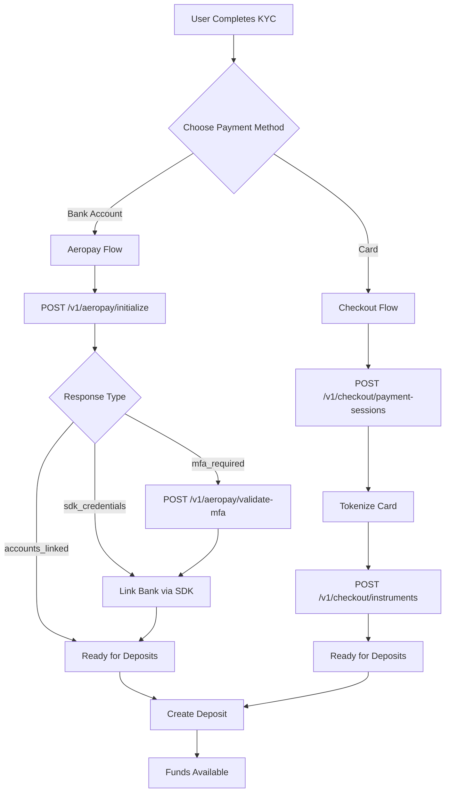

# Payments API

The Payments API provides multiple funding options for deposits and withdrawals. Users can fund their accounts via bank transfers (ACH) through Aeropay or card payments through Checkout.com.

<Warning>
**Authentication Required** - All payment endpoints require a valid access token. See [Authentication Setup](/getting-started/authentication) for setup instructions.
</Warning>

## Payment Methods

| Method | Provider | Type | Speed |
|--------|----------|------|-------|
| Bank Transfer (ACH) | Aeropay | Bank account linking | 1-3 business days |
| Debit/Credit Card | Checkout.com | Card payments | Instant |
| Apple Pay | Checkout.com | Mobile wallet | Instant |

## APIs

### Aeropay API

Bank account linking and ACH transfers.

**Orchestrated Endpoints (Recommended):**
| Method | Endpoint | Description |
|--------|----------|-------------|
| `POST` | `/v1/aeropay/initialize` | Start bank linking - handles user creation and MFA automatically |
| `POST` | `/v1/aeropay/validate-mfa` | Submit MFA code if required |
| `GET` | `/v1/aeropay/methods` | List payment methods with limits and FIFO rules |
| `POST` | `/v1/aeropay/deposits` | Create ACH deposit |
| `POST` | `/v1/aeropay/withdrawals` | Create ACH withdrawal |

[Aeropay Integration Guide](/api-reference/payments/aeropay-guide)

### Checkout API

Card payment processing:
| Method | Endpoint | Description |
|--------|----------|-------------|
| `POST` | `/v1/checkout/payment-sessions` | Request payment session for card tokenization |
| `POST` | `/v1/checkout/instruments` | Save tokenized card as instrument |
| `POST` | `/v1/checkout/deposits` | Process card or Apple Pay deposit |
| `POST` | `/v1/checkout/withdrawals` | Process card or Apple Pay withdrawal |

[Checkout Integration Guide](/api-reference/payments/checkout-guide)

### Funding API

Manage funding sources and transactions:
| Method | Endpoint | Description |
|--------|----------|-------------|
| `GET` | `/v1/funding/sources` | List funding sources |
| `GET` | `/v1/funding/accounts` | List funding accounts |
| `PATCH` | `/v1/funding/accounts/{id}` | Update funding account |
| `GET` | `/v1/funding/transactions` | View transaction history |
| `GET` | `/v1/funding/transaction-requirements` | Check FIFO withdrawal requirements |

[Funding Management](/api-reference/payments/funding-management)

## Typical Integration Flow

### New User Onboarding



### Deposit Flow

1. **Select funding source** - User chooses linked bank/card
2. **Check limits** - Validate amount against transaction limits
3. **Enter amount** - Collect deposit amount
4. **Confirm** - Process the deposit
5. **Track status** - Monitor transaction completion

### Withdrawal Flow

1. **Check FIFO requirements** - Get withdrawal requirements from funding source
2. **Select destination** - User chooses where to send funds (must follow FIFO)
3. **Enter amount** - Validate against available balance and requirements
4. **Confirm** - Process the withdrawal
5. **Track status** - Monitor transaction completion

## FIFO Withdrawal Requirements

Withdrawals must follow **FIFO (First-In-First-Out) rules**. Funds must be returned to their original deposit source before they can be withdrawn elsewhere.

### Example

1. User deposits $1,000 from Bank A
2. User deposits $500 from Bank B
3. User wants to withdraw $1,200

**Required withdrawal split:**
- $500 to Bank B (most recent deposit)
- $700 to Bank A (remaining amount)

### Checking Requirements

Use the `/v1/funding/transaction-requirements` endpoint or check the `withdrawalRequirements` field in Aeropay's `GetAeropayMethods` response.

```json
{
  "withdrawalRequirements": [
    {
      "amount": "500.00",
      "currency": "USD",
      "fundingSourceId": "fs_bank_b",
      "description": "Must withdraw to original deposit source"
    }
  ]
}
```

## Funding Source Types

The `FundingSourceType` enum identifies the payment method:

| Type | Description |
|------|-------------|
| `FUNDING_SOURCE_TYPE_BANK_ACCOUNT` | Traditional bank account |
| `FUNDING_SOURCE_TYPE_AEROPAY_BANK_ACCOUNT` | Aeropay-linked bank account |
| `FUNDING_SOURCE_TYPE_CHECKOUT_CARD` | Tokenized payment card |
| `FUNDING_SOURCE_TYPE_APPLE_PAY` | Apple Pay |

## Transaction States

| State | Description |
|-------|-------------|
| `TRANSACTION_STATE_ACKNOWLEDGED` | Transaction received |
| `TRANSACTION_STATE_PROCESSING` | Being processed |
| `TRANSACTION_STATE_COMPLETED` | Successfully completed |
| `TRANSACTION_STATE_CANCELLED` | Cancelled |
| `TRANSACTION_STATE_ALLOCATED` | Funds allocated |
| `TRANSACTION_STATE_REFUNDED` | Fully refunded |
| `TRANSACTION_STATE_PARTIALLY_REFUNDED` | Partially refunded |

## Transaction Types

| Type | Description |
|------|-------------|
| `TRANSACTION_TYPE_DEPOSIT` | Funds deposited |
| `TRANSACTION_TYPE_WITHDRAWAL` | Funds withdrawn |
| `TRANSACTION_TYPE_TRANSFER` | Internal transfer |
| `TRANSACTION_TYPE_EXECUTION_FEE` | Trading fee |
| `TRANSACTION_TYPE_SETTLEMENT_FEE` | Settlement fee |

## Best Practices

1. **Use orchestrated endpoints** - For Aeropay, use `/v1/aeropay/initialize` instead of primitive endpoints
2. **Check limits before transactions** - Use the Aeropay methods or funding transaction requirements APIs
3. **Respect FIFO rules** - Always check withdrawal requirements before processing
4. **Handle all states** - Implement UI for pending, success, and failure
5. **Implement webhooks** - Don't rely solely on polling for status updates
6. **Validate amounts client-side** - Reduce failed API calls
7. **Store payment method IDs** - Cache linked payment methods for faster checkout
