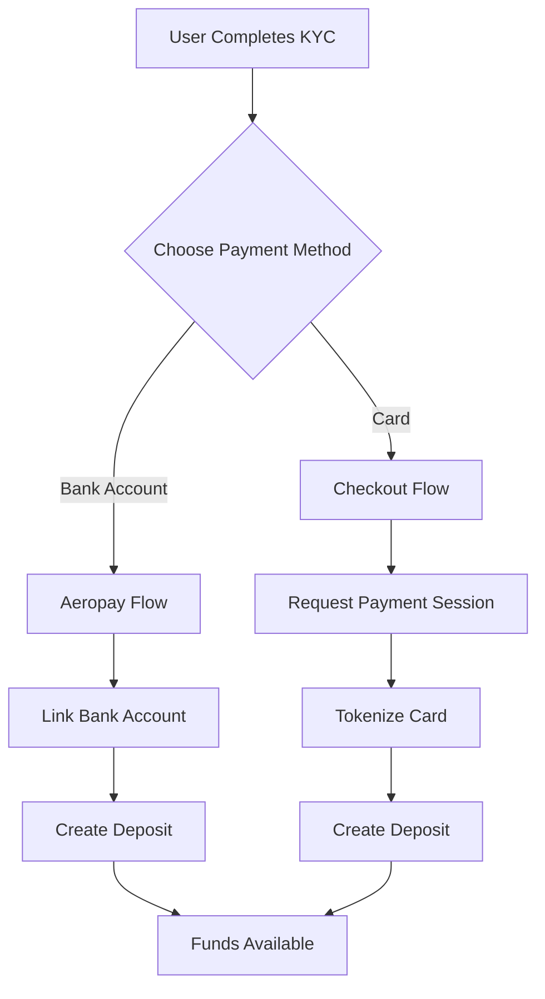

# Payments API

The Payments API provides multiple funding options for deposits and withdrawals. Users can fund their accounts via bank transfers (ACH) through Aeropay or card payments through Checkout.com.

## Payment Methods

| Method | Provider | Type | Speed |
|--------|----------|------|-------|
| Bank Transfer (ACH) | Aeropay | Bank account linking | 1-3 business days |
| Debit/Credit Card | Checkout.com | Card payments | Instant |
| Apple Pay | Checkout.com | Mobile wallet | Instant |

## APIs

### Aeropay API

Bank account linking and ACH transfers:
- Link bank accounts securely
- Create ACH deposits
- Create ACH withdrawals

[Aeropay Integration Guide](/api-reference/payments/aeropay-guide)

### Checkout API

Card payment processing:
- Tokenize payment cards
- Process card deposits
- Process card withdrawals
- Apple Pay support

[Checkout Integration Guide](/api-reference/payments/checkout-guide)

### Funding API

Manage funding sources and transactions:
- List funding sources
- List funding accounts
- View transaction history
- Check transaction requirements

[Funding Management](/api-reference/payments/funding-management)

## Typical Integration Flow

### New User Onboarding

### Deposit Flow

1. **Select funding source** - User chooses linked bank/card
2. **Enter amount** - Validate against limits
3. **Confirm** - Process the deposit
4. **Track status** - Monitor transaction completion

### Withdrawal Flow

1. **Select destination** - User chooses where to send funds
2. **Enter amount** - Validate against available balance
3. **Confirm** - Process the withdrawal
4. **Track status** - Monitor transaction completion

## Funding Source Types

The `FundingSourceType` enum identifies the payment method:

| Type | Description |
|------|-------------|
| `FUNDING_SOURCE_TYPE_BANK_ACCOUNT` | Traditional bank account |
| `FUNDING_SOURCE_TYPE_AEROPAY_BANK_ACCOUNT` | Aeropay-linked bank account |
| `FUNDING_SOURCE_TYPE_CHECKOUT_CARD` | Tokenized payment card |
| `FUNDING_SOURCE_TYPE_APPLE_PAY` | Apple Pay |

## Transaction States

| State | Description |
|-------|-------------|
| `TRANSACTION_STATE_ACKNOWLEDGED` | Transaction received |
| `TRANSACTION_STATE_PROCESSING` | Being processed |
| `TRANSACTION_STATE_COMPLETED` | Successfully completed |
| `TRANSACTION_STATE_CANCELLED` | Cancelled |
| `TRANSACTION_STATE_ALLOCATED` | Funds allocated |
| `TRANSACTION_STATE_REFUNDED` | Fully refunded |
| `TRANSACTION_STATE_PARTIALLY_REFUNDED` | Partially refunded |

## Transaction Types

| Type | Description |
|------|-------------|
| `TRANSACTION_TYPE_DEPOSIT` | Funds deposited |
| `TRANSACTION_TYPE_WITHDRAWAL` | Funds withdrawn |
| `TRANSACTION_TYPE_TRANSFER` | Internal transfer |
| `TRANSACTION_TYPE_EXECUTION_FEE` | Trading fee |
| `TRANSACTION_TYPE_SETTLEMENT_FEE` | Settlement fee |

## Best Practices

1. **Store funding source IDs** - Cache linked payment methods for faster checkout
2. **Check limits before transactions** - Use the transaction requirements API
3. **Handle all states** - Implement UI for pending, success, and failure
4. **Implement webhooks** - Don't rely solely on polling for status updates
5. **Validate amounts client-side** - Reduce failed API calls
