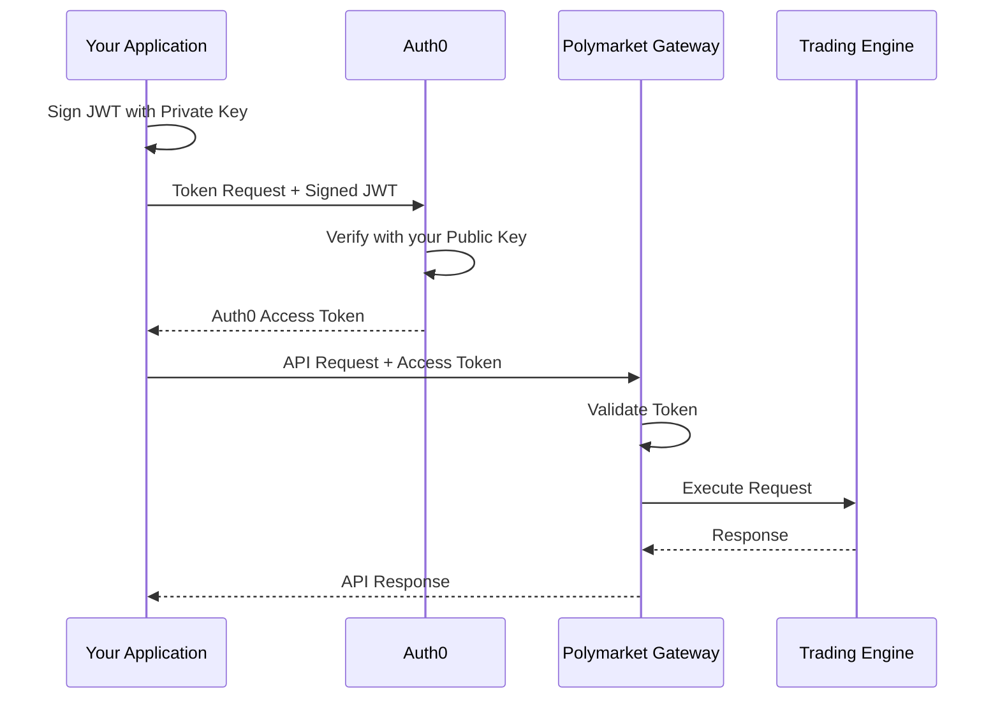

# Auth0 Onboarding

<Tip>
**Quick Start: Generate your key pair**
```bash
openssl genrsa -out my_private_key.pem 2048
openssl rsa -in my_private_key.pem -pubout -out my_public_key.pem
```
Send us `my_public_key.pem` - keep `my_private_key.pem` secret!
</Tip>

The Polymarket Exchange API uses [Auth0](https://auth0.com/) for authentication with **Private Key JWT** authentication. This is a more secure method than client secrets - you generate your own key pair and keep the private key secure.

## Overview

Authentication follows a two-step flow:

1. **Create a signed JWT assertion** - Sign a JWT with your private key
2. **Exchange for Auth0 access token** - Send the assertion to Auth0
3. **Call API with access token** - The gateway validates your token and handles authorization



## Getting Your Credentials

To access the Polymarket Exchange API, you need to:

1. **Generate an RSA key pair** (you keep the private key secure)
2. **Submit your public key to us** during onboarding
3. **Receive your Client ID** (this is not a secret)

| What You Provide | What We Provide |
|-----------------|-----------------|
| Your RSA Public Key | Client ID |
| Company Information | Auth0 Domain |
| IP Addresses | API Audience |

<Info>
**Private Key JWT is more secure than client secrets** because:
- You control your private key - we never see it
- No shared secrets to transmit or store
- You can rotate keys independently
- Compromised keys can be quickly revoked
</Info>

## Step 1: Generate Your Key Pair

Run these commands to generate an RSA key pair:

```bash
# Generate a 2048-bit RSA private key
openssl genrsa -out my_private_key.pem 2048

# Extract the public key
openssl rsa -in my_private_key.pem -pubout -out my_public_key.pem
```

<Warning>
**Keep your private key secure!**
- Store it in encrypted storage or a secrets manager
- Never share it with anyone, including us
- Never commit it to version control
- Set restrictive file permissions: `chmod 600 my_private_key.pem`
</Warning>

## Step 2: Submit Your Public Key

Send us your **public key** (`my_public_key.pem` contents) along with:

- Company name and ISV identifier
- Technical contact information
- IP addresses for API access
- Environment requested (dev, preprod, production)

Your public key looks like this:
```
-----BEGIN PUBLIC KEY-----
MIIBIjANBgkqhkiG9w0BAQEFAAOCAQ8AMIIBCgKCAQEA...
(several lines of base64 encoded data)
...IDAQAB
-----END PUBLIC KEY-----
```

## Step 3: Authenticate with Private Key JWT

Once onboarded, authenticate by creating a signed JWT assertion and exchanging it for an access token.

### Create Client Assertion JWT

Create a JWT with these claims, signed with your private key using RS256:

```json
{
  "iss": "YOUR_CLIENT_ID",
  "sub": "YOUR_CLIENT_ID",
  "aud": "https://pmx-preprod.us.auth0.com/oauth/token",
  "iat": 1703270400,
  "exp": 1703270700,
  "jti": "unique-random-uuid"
}
```

| Claim | Description |
|-------|-------------|
| `iss` | Your client ID (issuer) |
| `sub` | Your client ID (subject) |
| `aud` | Auth0 token endpoint URL |
| `iat` | Issued at time (Unix timestamp) |
| `exp` | Expiration time (max 5 minutes from iat) |
| `jti` | Unique token ID (prevents replay attacks) |

### Request Access Token

```bash
curl --request POST \
  --url "https://pmx-preprod.us.auth0.com/oauth/token" \
  --header "content-type: application/json" \
  --data '{
    "client_id": "YOUR_CLIENT_ID",
    "client_assertion_type": "urn:ietf:params:oauth:client-assertion-type:jwt-bearer",
    "client_assertion": "YOUR_SIGNED_JWT_ASSERTION",
    "audience": "https://api.preprod.polymarketexchange.com",
    "grant_type": "client_credentials"
  }'
```

### Token Response

```json
{
  "access_token": "eyJhbGciOiJSUzI1NiIsInR5cCI6IkpXVCIs...",
  "token_type": "Bearer",
  "expires_in": 180
}
```

## Complete Python Example

```python
import jwt
import uuid
import time
import requests
from cryptography.hazmat.primitives import serialization

class Auth0Client:
    def __init__(self, domain: str, client_id: str, audience: str, private_key_path: str):
        self.domain = domain
        self.client_id = client_id
        self.audience = audience
        self.private_key_path = private_key_path
        self.token = None
        self.token_expiry = None

    def _load_private_key(self):
        """Load the RSA private key from file."""
        with open(self.private_key_path, 'rb') as f:
            return serialization.load_pem_private_key(f.read(), password=None)

    def _create_client_assertion(self) -> str:
        """Create a signed JWT for client authentication."""
        private_key = self._load_private_key()
        now = int(time.time())

        claims = {
            "iss": self.client_id,
            "sub": self.client_id,
            "aud": f"https://{self.domain}/oauth/token",
            "iat": now,
            "exp": now + 300,  # 5 minutes
            "jti": str(uuid.uuid4()),
        }

        return jwt.encode(claims, private_key, algorithm="RS256")

    def get_token(self) -> str:
        """Get a valid access token, refreshing if necessary."""
        if self._is_token_valid():
            return self.token

        # Create client assertion
        assertion = self._create_client_assertion()

        # Request access token
        response = requests.post(
            f"https://{self.domain}/oauth/token",
            json={
                "client_id": self.client_id,
                "client_assertion_type": "urn:ietf:params:oauth:client-assertion-type:jwt-bearer",
                "client_assertion": assertion,
                "audience": self.audience,
                "grant_type": "client_credentials"
            },
            headers={"content-type": "application/json"}
        )
        response.raise_for_status()

        data = response.json()
        self.token = data["access_token"]
        # Set expiry with 30-second buffer
        self.token_expiry = time.time() + data["expires_in"] - 30

        return self.token

    def _is_token_valid(self) -> bool:
        """Check if current token is still valid."""
        if not self.token or not self.token_expiry:
            return False
        return time.time() < self.token_expiry


# Usage
auth0 = Auth0Client(
    domain="pmx-preprod.us.auth0.com",
    client_id="YOUR_CLIENT_ID",
    audience="https://api.preprod.polymarketexchange.com",
    private_key_path="/path/to/my_private_key.pem"
)

token = auth0.get_token()
```

**Required packages:**
```bash
pip install PyJWT cryptography requests
```

## Complete Go Example

```go
package main

import (
    "crypto/rsa"
    "crypto/x509"
    "encoding/json"
    "encoding/pem"
    "fmt"
    "net/http"
    "os"
    "time"

    "github.com/golang-jwt/jwt/v5"
    "github.com/google/uuid"
)

func getAuth0Token(domain, clientID, audience, privateKeyPath string) (string, error) {
    // Load private key
    keyData, err := os.ReadFile(privateKeyPath)
    if err != nil {
        return "", fmt.Errorf("read key file: %w", err)
    }

    block, _ := pem.Decode(keyData)
    privateKey, err := x509.ParsePKCS1PrivateKey(block.Bytes)
    if err != nil {
        return "", fmt.Errorf("parse private key: %w", err)
    }

    // Create client assertion JWT
    now := time.Now()
    claims := jwt.MapClaims{
        "iss": clientID,
        "sub": clientID,
        "aud": fmt.Sprintf("https://%s/oauth/token", domain),
        "iat": now.Unix(),
        "exp": now.Add(5 * time.Minute).Unix(),
        "jti": uuid.New().String(),
    }

    token := jwt.NewWithClaims(jwt.SigningMethodRS256, claims)
    assertion, err := token.SignedString(privateKey)
    if err != nil {
        return "", fmt.Errorf("sign assertion: %w", err)
    }

    // Request access token from Auth0
    // (implement HTTP POST to token endpoint)
    // ...

    return accessToken, nil
}
```

## Using the Access Token

Include the access token in the `Authorization` header for all API requests:

### REST API

```bash
curl -X GET "https://api.preprod.polymarketexchange.com/v1/whoami" \
  -H "Authorization: Bearer YOUR_ACCESS_TOKEN" \
  -H "x-participant-id: firms/ISV-Participant-YourISV/users/your-user"
```

### gRPC

```python
import grpc

# Create metadata with token
metadata = [
    ('authorization', f'Bearer {access_token}')
]

# Make gRPC call with metadata
response = stub.SomeMethod(request, metadata=metadata)
```

## Key Rotation

You can rotate your keys at any time:

1. Generate a new key pair
2. Submit the new public key to us
3. We add the new key to your Auth0 app (both old and new will work)
4. Update your systems to use the new private key
5. Notify us to remove the old public key

## Environments

| Environment | Auth0 Domain | API Base URL |
|-------------|--------------|--------------|
| Development | `pmx-dev01.us.auth0.com` | `api.dev01.polymarketexchange.com` |
| Pre-production | `pmx-preprod.us.auth0.com` | `traderapi.us-east-1.privatelink.preprod.polymarketexchange.com` |
| Production | `pmx-prod.us.auth0.com` | `traderapi.us-east-1.privatelink.prod.polymarketexchange.com` |

<Info>
Each environment requires separate onboarding. Your pre-production credentials will not work in production.
</Info>

## Troubleshooting

### Common Errors

| Error | Cause | Solution |
|-------|-------|----------|
| `invalid_client` | JWT signature verification failed | Verify private key matches registered public key |
| `invalid_client_assertion` | Malformed JWT or wrong claims | Check JWT claims (iss, sub, aud, exp) |
| `401 Unauthorized` | Invalid or expired access token | Request a new access token |
| `403 Forbidden` | IP not allowlisted | Contact support to add your IP |

### Debugging JWT Claims

If authentication fails, verify your client assertion JWT contains correct claims:

```json
{
  "iss": "YOUR_CLIENT_ID",
  "sub": "YOUR_CLIENT_ID",
  "aud": "https://pmx-preprod.us.auth0.com/oauth/token",
  "iat": 1703270400,
  "exp": 1703270700,
  "jti": "550e8400-e29b-41d4-a716-446655440000"
}
```

Common mistakes:
- Wrong `aud` (must be the Auth0 token endpoint, not the API)
- Expired JWT (exp in the past)
- Reused `jti` (must be unique per request)

---

## API Scopes

Your Auth0 application is granted specific **scopes** that control which API endpoints you can access. Scopes are included in your access token and validated by the API.

### Available Scopes

| Scope | Description |
|-------|-------------|
| `read:orders` | View orders and trade history |
| `write:orders` | Create and cancel orders |
| `read:positions` | View account positions and balances |
| `read:marketdata` | Access BBO (best bid/offer) and streaming market data |
| `read:l2marketdata` | Access L2 orderbook depth (premium) |
| `instruments:read` | List instruments and metadata |
| `read:funding` | View funding accounts and transactions |
| `write:funding` | Create deposits and withdrawals |

### Scope Requirements by Endpoint

| Endpoint | Method | Required Scope |
|----------|--------|----------------|
| `/v1/trading/orders` | POST | `write:orders` |
| `/v1/trading/orders/cancel` | POST | `write:orders` |
| `/v1/orders/search` | POST | `read:orders` |
| `/v1/positions` | GET | `read:positions` |
| `/v1/positions/balances` | GET | `read:positions` |
| `/v1/orderbook/{symbol}` | GET | `read:l2marketdata` |
| `/v1/orderbook/{symbol}/bbo` | GET | `read:marketdata` |
| `/v1/refdata/instruments` | GET | `instruments:read` |
| `/v1/refdata/symbols` | GET | `instruments:read` |
| `/v1/funding/accounts` | GET | `read:funding` |
| `/v1/aeropay/deposits` | POST | `write:funding` |
| `/v1/checkout/deposits` | POST | `write:funding` |
| `/v1/health` | GET | *(no auth required)* |

### Checking Your Scopes

Your granted scopes are included in your access token. You can decode the token to see them:

```python
import base64
import json

# Decode the payload (middle part of JWT)
payload = access_token.split('.')[1]
payload += '=' * (4 - len(payload) % 4)  # Add padding
claims = json.loads(base64.urlsafe_b64decode(payload))

print("Granted scopes:", claims.get("scope", ""))
```

<Info>
If you receive a `403 Forbidden` error, check that your application has been granted the required scope for that endpoint. Contact support to request additional scopes.
</Info>

---

## Auth0 Documentation

For more details on Private Key JWT authentication:

- [Private Key JWT Client Authentication](https://auth0.com/docs/get-started/authentication-and-authorization-flow/authenticate-with-private-key-jwt)
- [Machine-to-Machine Applications](https://auth0.com/docs/get-started/applications/application-types#machine-to-machine-applications)
- [RFC 7523 - JWT Profile for Client Authentication](https://datatracker.ietf.org/doc/html/rfc7523)

## Next Steps

<CardGroup cols={2}>
  <Card title="Health Check" icon="heart-pulse" href="/getting-started/health-check">
    Verify API connectivity
  </Card>
  <Card title="REST API" icon="code" href="/api-reference/orderbook/overview">
    Explore the REST API endpoints
  </Card>
  <Card title="gRPC Streaming" icon="bolt" href="/streaming-endpoints/grpc-overview">
    Set up real-time data streams
  </Card>
  <Card title="Connection Options" icon="plug" href="/getting-started/connection-options">
    Review connection methods
  </Card>
</CardGroup>
