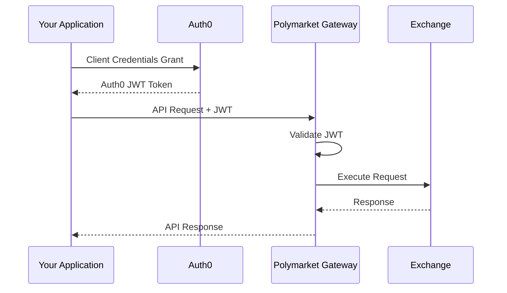

# Auth0 Onboarding

The Polymarket Exchange API uses [Auth0](https://auth0.com/) for authentication. This guide explains how to obtain credentials and authenticate with the API.

## Overview

Authentication follows a two-step flow:

1. **Obtain Auth0 JWT** - Use your client credentials to get a JWT from Auth0
2. **Call API with JWT** - The gateway validates your JWT and handles authorization



## Getting Your Credentials

To access the Polymarket Exchange API, you'll need the following credentials from our onboarding team:

| Credential | Description |
|------------|-------------|
| **Client ID** | Your unique application identifier |
| **Client Secret** | Secret key for authentication (keep secure!) |
| **Auth0 Domain** | Auth0 tenant URL (e.g., `your-tenant.us.auth0.com`) |
| **API Audience** | The API identifier for token scoping |

<Warning>
**Keep your Client Secret secure!** Never expose it in client-side code, public repositories, or logs. Treat it like a password.
</Warning>

### Requesting Access

1. Contact the Polymarket Exchange onboarding team
2. Provide your company information and use case
3. Provide the **IP addresses** that will access the API (required for allowlisting)
4. Receive your credentials via secure channel

## Obtaining JWT Tokens

Use the **OAuth 2.0 Client Credentials Grant** to obtain JWT tokens from Auth0.

### Token Request

```bash
curl --request POST \
  --url "https://YOUR_AUTH0_DOMAIN/oauth/token" \
  --header "content-type: application/json" \
  --data '{
    "client_id": "YOUR_CLIENT_ID",
    "client_secret": "YOUR_CLIENT_SECRET",
    "audience": "YOUR_API_AUDIENCE",
    "grant_type": "client_credentials"
  }'
```

### Token Response

```json
{
  "access_token": "eyJhbGciOiJSUzI1NiIsInR5cCI6IkpXVCIs...",
  "token_type": "Bearer",
  "expires_in": 86400
}
```

| Field | Description |
|-------|-------------|
| `access_token` | The JWT to use for API calls |
| `token_type` | Always "Bearer" |
| `expires_in` | Token lifetime in seconds |

### Python Example

```python
import requests
from datetime import datetime, timedelta

class Auth0Client:
    def __init__(self, domain: str, client_id: str, client_secret: str, audience: str):
        self.domain = domain
        self.client_id = client_id
        self.client_secret = client_secret
        self.audience = audience
        self.token = None
        self.token_expiry = None

    def get_token(self) -> str:
        """Get a valid token, refreshing if necessary."""
        if self._is_token_valid():
            return self.token

        response = requests.post(
            f"https://{self.domain}/oauth/token",
            json={
                "client_id": self.client_id,
                "client_secret": self.client_secret,
                "audience": self.audience,
                "grant_type": "client_credentials"
            },
            headers={"content-type": "application/json"}
        )
        response.raise_for_status()

        data = response.json()
        self.token = data["access_token"]
        # Set expiry with 5-minute buffer
        self.token_expiry = datetime.now() + timedelta(seconds=data["expires_in"] - 300)

        return self.token

    def _is_token_valid(self) -> bool:
        """Check if current token is still valid."""
        if not self.token or not self.token_expiry:
            return False
        return datetime.now() < self.token_expiry


# Usage
auth0 = Auth0Client(
    domain="your-tenant.us.auth0.com",
    client_id="your_client_id",
    client_secret="your_client_secret",
    audience="https://api.polymarketexchange.com"
)

token = auth0.get_token()
```

## Using the Token

Include the JWT in the `Authorization` header for all API requests:

### REST API

```bash
curl -X GET "https://api.polymarketexchange.com/rest/api/v1/health" \
  -H "Authorization: Bearer YOUR_JWT_TOKEN"
```

### gRPC

```python
import grpc

# Create metadata with token
metadata = [
    ('authorization', token)  # Note: lowercase 'authorization'
]

# Make gRPC call with metadata
response = stub.SomeMethod(request, metadata=metadata)
```

## Token Lifecycle

### Token Expiration

Auth0 tokens have a configurable expiration (typically 24 hours). Your application should:

1. **Cache the token** - Don't request a new token for every API call
2. **Track expiration** - Store the `expires_in` value
3. **Refresh proactively** - Get a new token before the current one expires (e.g., 5 minutes before)

### Best Practices

```python
# Good: Reuse token until near expiration
token = auth0.get_token()  # Returns cached token if valid
response = api.call(token)

# Bad: Request new token for every call
token = auth0.request_new_token()  # Unnecessary Auth0 calls
response = api.call(token)
```

## IP Allowlisting

For security, all API access is restricted to pre-approved IP addresses.

- Provide your IP addresses during onboarding
- Both individual IPs and CIDR ranges are supported (e.g., `203.0.113.10` or `10.0.0.0/8`)
- Requests from non-allowlisted IPs will be rejected at Auth0
- Contact support to update your allowed IPs

## Environments

| Environment | Auth0 Domain | API Base URL |
|-------------|--------------|--------------|
| Pre-production | Provided during onboarding | `traderapi.us-east-1.privatelink.preprod.polymarketexchange.com` |
| Production | Provided during onboarding | `traderapi.us-east-1.privatelink.prod.polymarketexchange.com` |

<Info>
Each environment has separate credentials. Your pre-production credentials will not work in production.
</Info>

## Troubleshooting

### Common Errors

| Error | Cause | Solution |
|-------|-------|----------|
| `401 Unauthorized` | Invalid or expired token | Request a new token |
| `403 Forbidden` | IP not allowlisted | Contact support to add your IP |
| `invalid_client` | Wrong client ID or secret | Verify your credentials |
| `invalid_audience` | Wrong audience value | Use the audience provided during onboarding |

### Token Validation Failed

If you receive authentication errors, verify:

1. **Token is not expired** - Check the `exp` claim
2. **Correct audience** - The `aud` claim must match the API audience
3. **Correct issuer** - The `iss` claim must match your Auth0 domain
4. **IP is allowlisted** - Ensure your request originates from an approved IP

### Debugging JWT Claims

You can decode your JWT at [jwt.io](https://jwt.io/) to inspect the claims (for debugging only - never paste production tokens in third-party tools).

Expected claims in a valid token:

```json
{
  "iss": "https://your-tenant.us.auth0.com/",
  "aud": "https://api.polymarketexchange.com",
  "exp": 1704307200,
  "iat": 1704220800,
  "https://polymarket.us/firm_id": "your_firm_id",
  "https://polymarket.us/org_name": "Your Company Name"
}
```

## Auth0 Documentation

For more details on OAuth 2.0 and the Client Credentials flow, see the official Auth0 documentation:

- [Client Credentials Flow](https://auth0.com/docs/get-started/authentication-and-authorization-flow/client-credentials-flow)
- [Call Your API Using the Client Credentials Flow](https://auth0.com/docs/get-started/authentication-and-authorization-flow/call-your-api-using-the-client-credentials-flow)
- [Machine-to-Machine Applications](https://auth0.com/docs/get-started/applications/application-types#machine-to-machine-applications)
- [Access Tokens](https://auth0.com/docs/secure/tokens/access-tokens)

## Next Steps

<CardGroup cols={2}>
  <Card title="Health Check" icon="heart-pulse" href="/getting-started/health-check">
    Verify API connectivity
  </Card>
  <Card title="REST API" icon="code" href="/api-reference/orderbook/overview">
    Explore the REST API endpoints
  </Card>
  <Card title="gRPC Streaming" icon="bolt" href="/streaming-endpoints/grpc-overview">
    Set up real-time data streams
  </Card>
  <Card title="Connection Options" icon="plug" href="/getting-started/connection-options">
    Review connection methods
  </Card>
</CardGroup>
