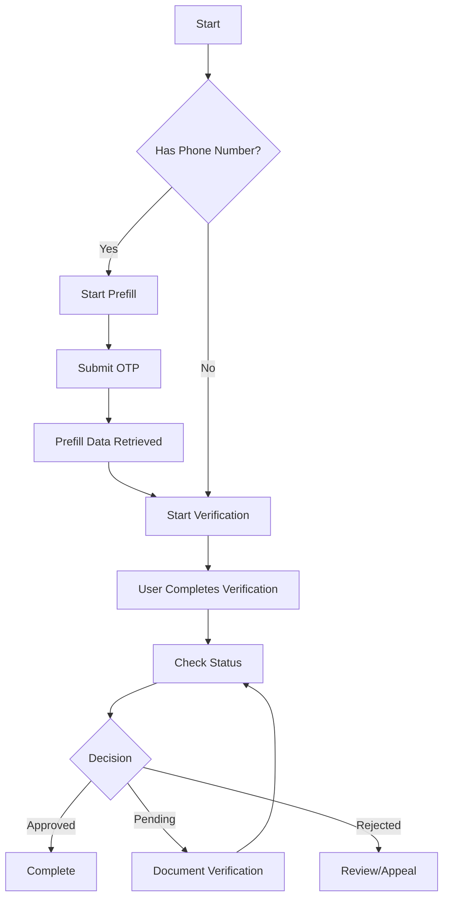

# KYC API

The KYC (Know Your Customer) API enables identity verification for user onboarding. This API supports a streamlined verification flow with optional prefill capabilities to reduce friction for users.

## Verification Workflow

The KYC process follows this general flow:



## Endpoints

| Method | Endpoint | Description |
|--------|----------|-------------|
| `POST` | `/v1/kyc/prefill` | Start KYC prefill process |
| `POST` | `/v1/kyc/prefill/otp` | Submit OTP for prefill verification |
| `POST` | `/v1/kyc/start` | Start KYC verification |
| `GET` | `/v1/kyc/status` | Get current KYC status |
| `POST` | `/v1/kyc/referral-codes` | Create ISV referral code |
| `GET` | `/v1/kyc/referral-codes` | List referral codes |
| `GET` | `/v1/kyc/referral-codes/{code}` | Validate a referral code |

## Quick Start

### Option 1: With Prefill (Recommended)

Prefill allows users to auto-populate their information using their phone number, reducing manual data entry.

1. **Start Prefill**
```bash
curl -X POST "https://api.polymarketexchange.com/rest/api/v1/kyc/prefill" \
  -H "Authorization: Bearer YOUR_TOKEN" \
  -H "Content-Type: application/json" \
  -d '{
    "phoneNumber": "+15551234567",
    "dateOfBirth": "1990-01-15",
    "userId": "user_123",
    "sessionToken": "session_abc"
  }'
```

2. **Submit OTP** (sent to user's phone)
```bash
curl -X POST "https://api.polymarketexchange.com/rest/api/v1/kyc/prefill/otp" \
  -H "Authorization: Bearer YOUR_TOKEN" \
  -H "Content-Type: application/json" \
  -d '{
    "otp": "123456",
    "externalId": "ext_id_from_prefill_response"
  }'
```

3. **Start Verification** (with prefilled data)
```bash
curl -X POST "https://api.polymarketexchange.com/rest/api/v1/kyc/start" \
  -H "Authorization: Bearer YOUR_TOKEN" \
  -H "Content-Type: application/json" \
  -d '{
    "userId": "user_123",
    "firstName": "John",
    "lastName": "Doe",
    "email": "john@example.com",
    "phoneNumber": "+15551234567",
    "dateOfBirth": "1990-01-15",
    "ssn": "***-**-1234",
    "address": {
      "addressLine1": "123 Main St",
      "city": "New York",
      "state": "NY",
      "postalCode": "10001",
      "country": "US"
    },
    "sessionToken": "session_abc",
    "agreementTime": "2024-01-15T10:30:00Z"
  }'
```

### Option 2: Direct Verification

Skip prefill and go directly to verification:

```bash
curl -X POST "https://api.polymarketexchange.com/rest/api/v1/kyc/start" \
  -H "Authorization: Bearer YOUR_TOKEN" \
  -H "Content-Type: application/json" \
  -d '{
    "userId": "user_123",
    "firstName": "John",
    "lastName": "Doe",
    ...
  }'
```

### Check Status

```bash
curl -X GET "https://api.polymarketexchange.com/rest/api/v1/kyc/status?externalId=ext_123" \
  -H "Authorization: Bearer YOUR_TOKEN"
```

## KYC Status

The status response contains:

| Field | Description |
|-------|-------------|
| `decision` | Final decision (approved, denied, pending) |
| `status` | Current status in the workflow |
| `subStatus` | Detailed sub-status |
| `externalId` | External reference ID |

## Document Verification (DocV)

If additional document verification is required, the `StartKYCVerification` response will include DocV details:

| Field | Description |
|-------|-------------|
| `docvTransactionToken` | Token for document verification |
| `eventId` | Event identifier |
| `qrCode` | QR code for mobile document capture |
| `url` | URL for web-based document capture |

## Next Steps

- [Prefill Flow Details](/isv-partners/kyc/prefill-flow)
- [Verification Flow Details](/isv-partners/kyc/verification-flow)
- [Referral Codes](/isv-partners/kyc/referral-codes)
