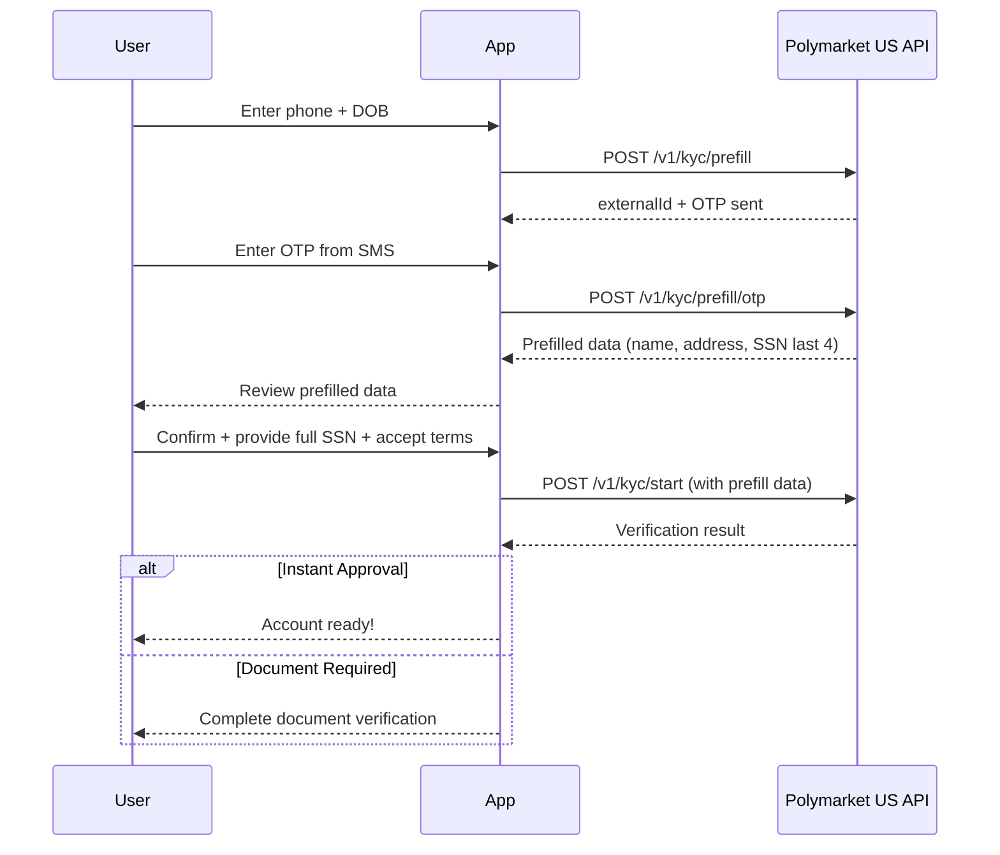

# KYC Prefill Flow

The prefill flow allows users to automatically populate their KYC information using their phone number. This significantly reduces manual data entry and improves the user experience.

## How It Works

1. User provides their phone number and date of birth
2. System sends an OTP (One-Time Password) to the phone
3. User enters the OTP to verify phone ownership
4. System returns prefilled user data (name, address, SSN last 4, etc.)
5. User reviews and submits for verification via `/v1/kyc/start`

## Step 1: Start Prefill

Initiate the prefill process with the user's phone number and date of birth.

### Request

```bash
POST /v1/kyc/prefill
```

```json
{
  "phoneNumber": "+15551234567",
  "dateOfBirth": "1990-01-15",
  "userId": "user_123",
  "sessionToken": "session_abc",
  "ipAddress": "192.168.1.1"
}
```

### Request Fields

| Field | Type | Required | Description |
|-------|------|----------|-------------|
| `phoneNumber` | string | Yes | User's phone number with country code |
| `dateOfBirth` | string | Yes | Date of birth (YYYY-MM-DD format) |
| `userId` | string | Yes | Your internal user identifier |
| `sessionToken` | string | Yes | Session token for the request |
| `ipAddress` | string | No | User's IP address for fraud detection |

### Response

```json
{
  "status": {
    "decision": "pending",
    "status": "otp_sent",
    "subStatus": "",
    "externalId": "ext_abc123"
  },
  "externalId": "ext_abc123"
}
```

## Step 2: Submit OTP

After the user receives the OTP on their phone, submit it for verification.

### Request

```bash
POST /v1/kyc/prefill/otp
```

```json
{
  "otp": "123456",
  "externalId": "ext_abc123"
}
```

### Request Fields

| Field | Type | Required | Description |
|-------|------|----------|-------------|
| `otp` | string | Yes | The 6-digit OTP received by the user |
| `externalId` | string | Yes | External ID from the prefill response |

### Response

On successful OTP verification, the response includes prefilled user data:

```json
{
  "status": {
    "decision": "pending",
    "status": "prefill_complete",
    "subStatus": "",
    "externalId": "ext_abc123"
  },
  "firstName": "John",
  "middleName": "Michael",
  "lastName": "Doe",
  "dateOfBirth": "1990-01-15",
  "phoneNumber": "+15551234567",
  "email": "john.doe@example.com",
  "ssn": "1234",
  "address": {
    "addressLine1": "123 Main Street",
    "addressLine2": "Apt 4B",
    "city": "New York",
    "state": "NY",
    "postalCode": "10001",
    "country": "US"
  }
}
```

### Prefill Response Fields

| Field | Type | Description |
|-------|------|-------------|
| `firstName` | string | User's first name |
| `middleName` | string | User's middle name (if available) |
| `lastName` | string | User's last name |
| `dateOfBirth` | string | Date of birth |
| `phoneNumber` | string | Verified phone number |
| `email` | string | Email address (if available) |
| `ssn` | string | Last 4 digits of SSN |
| `address` | object | Address information |

<Note>
All fields except `status` are optional and may be null if data is not available from the prefill provider.
</Note>

## Step 3: Submit to KYC Verification

After receiving prefill data, use it to start the full verification process. The prefill response fields map directly to the `/v1/kyc/start` request.

### Mapping Prefill Data to Verification Request

```json
{
  "userId": "user_123",
  "firstName": "John",
  "middleName": "Michael",
  "lastName": "Doe",
  "email": "john.doe@example.com",
  "phoneNumber": "+15551234567",
  "dateOfBirth": "1990-01-15",
  "ssn": "123-45-6789",
  "address": {
    "addressLine1": "123 Main Street",
    "addressLine2": "Apt 4B",
    "city": "New York",
    "state": "NY",
    "postalCode": "10001",
    "country": "US"
  },
  "sessionToken": "session_abc",
  "agreementTime": "2024-01-15T10:30:00Z",
  "ipAddress": "192.168.1.1"
}
```

<Warning>
The prefill response returns only the last 4 digits of SSN. You must collect the full SSN from the user before submitting to `/v1/kyc/start`.
</Warning>

### Field Mapping

| Prefill Response | Verification Request | Notes |
|------------------|---------------------|-------|
| `firstName` | `firstName` | Direct mapping |
| `middleName` | `middleName` | Direct mapping |
| `lastName` | `lastName` | Direct mapping |
| `email` | `email` | Direct mapping, allow user to edit |
| `phoneNumber` | `phoneNumber` | Direct mapping |
| `dateOfBirth` | `dateOfBirth` | Direct mapping |
| `ssn` (last 4) | `ssn` (full) | Collect full SSN from user |
| `address` | `address` | Direct mapping |
| - | `agreementTime` | Capture when user accepts terms |
| - | `referralCode` | Optional, if applicable |

See [Verification Flow](/isv-partners/kyc/verification-flow) for complete details on the verification request and response.

## Complete Integration Flow



## Error Handling

### Common Errors

| Error | Description | Resolution |
|-------|-------------|------------|
| Invalid phone number | Phone number format is incorrect | Use E.164 format (+1XXXXXXXXXX) |
| OTP expired | OTP has expired (usually 10 minutes) | Restart the prefill flow |
| OTP invalid | Incorrect OTP entered | User should re-enter or request new OTP |
| Prefill not available | No data found for this phone/DOB | Proceed with manual verification |

### Retry Logic

If OTP verification fails:
1. Allow user to retry entering OTP (up to 3 attempts)
2. After 3 failed attempts, require new OTP request
3. Rate limit OTP requests to prevent abuse

## Sandbox Testing

For testing in the sandbox environment, use these Socure test values:

### Prefill Match Test Data

| Field | Value | Description |
|-------|-------|-------------|
| `dateOfBirth` | `1985-03-30` | Sandbox DOB that returns prefill data |
| `phoneNumber` | `14155551212` | Sandbox phone that matches prefill |

### No Prefill Match Test Data

| Field | Value | Description |
|-------|-------|-------------|
| `dateOfBirth` | `1985-03-30` | Same DOB |
| `phoneNumber` | `12067890036` | Phone that has no prefill data |

### OTP Codes

| Code | Result |
|------|--------|
| `123456` | Success - returns prefilled data |
| `00000` (5 zeros) | Reject - OTP verification fails |
| `000000` (6 zeros) | Pending - verification remains pending |

## Best Practices

1. **Validate phone format** before sending to API (E.164 format)
2. **Display countdown timer** for OTP expiration (typically 10 minutes)
3. **Allow users to skip prefill** and enter data manually
4. **Pre-populate form fields** with prefill data but allow editing
5. **Handle null fields gracefully** - not all data may be available
6. **Collect full SSN** from user since prefill only returns last 4 digits
7. **Track agreementTime** when user accepts terms, before calling `/v1/kyc/start`
