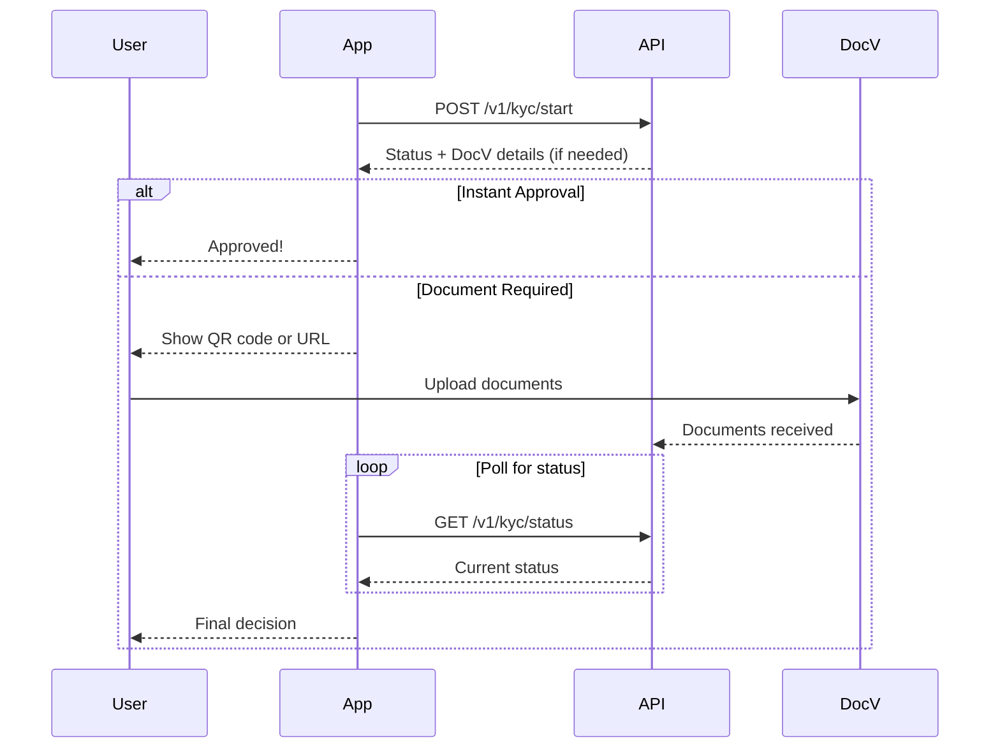

# KYC Verification Flow

The verification flow is the core KYC process that validates a user's identity. This can be started after prefill or directly with user-provided information.

## Starting Verification

### Request

```bash
POST /v1/kyc/start
```

```json
{
  "userId": "user_123",
  "firstName": "John",
  "middleName": "Michael",
  "lastName": "Doe",
  "email": "john.doe@example.com",
  "phoneNumber": "+15551234567",
  "dateOfBirth": "1990-01-15",
  "ssn": "123-45-6789",
  "address": {
    "addressLine1": "123 Main Street",
    "addressLine2": "Apt 4B",
    "city": "New York",
    "state": "NY",
    "postalCode": "10001",
    "country": "US"
  },
  "sessionToken": "session_abc",
  "agreementTime": "2024-01-15T10:30:00Z",
  "referralCode": "REF123",
  "ipAddress": "192.168.1.1"
}
```

### Request Fields

| Field | Type | Required | Description |
|-------|------|----------|-------------|
| `userId` | string | Yes | Your internal user identifier |
| `firstName` | string | Yes | Legal first name |
| `middleName` | string | No | Middle name |
| `lastName` | string | Yes | Legal last name |
| `email` | string | Yes | Email address |
| `phoneNumber` | string | Yes | Phone number with country code |
| `dateOfBirth` | string | Yes | Date of birth (YYYY-MM-DD) |
| `ssn` | string | Yes | Social Security Number |
| `address` | object | Yes | Residential address |
| `sessionToken` | string | Yes | Session token |
| `agreementTime` | datetime | Yes | When user agreed to terms |
| `referralCode` | string | No | Referral code if applicable |
| `ipAddress` | string | No | User's IP address |

### Address Object

| Field | Type | Required | Description |
|-------|------|----------|-------------|
| `addressLine1` | string | Yes | Street address |
| `addressLine2` | string | No | Apt/Suite/Unit number |
| `city` | string | Yes | City |
| `state` | string | Yes | State (2-letter code) |
| `postalCode` | string | Yes | ZIP/Postal code |
| `country` | string | Yes | Country code (e.g., "US") |

### Response

When document verification is required:

```json
{
  "status": {
    "decision": "REVIEW",
    "status": "ON_HOLD",
    "subStatus": "Document Request Initiated",
    "externalId": "user_123"
  },
  "docv": {
    "docvTransactionToken": "token_xyz",
    "eventId": "event_123",
    "qrCode": "data:image/png;base64,...",
    "url": "https://verify.example.com/session/abc123"
  }
}
```

## Verification Outcomes

### Instant Approval

If the identity can be verified immediately:

```json
{
  "status": {
    "decision": "ACCEPT",
    "status": "CLOSED",
    "subStatus": "",
    "externalId": "user_123"
  }
}
```

### Document Verification Required

If additional documents are needed, the response includes DocV details:

| Field | Description |
|-------|-------------|
| `docvTransactionToken` | Token for the document verification session |
| `eventId` | Event tracking identifier |
| `qrCode` | Base64-encoded QR code image for mobile scanning |
| `url` | Direct URL for web-based document upload |

**Document Verification Options:**

1. **QR Code** - User scans QR code with mobile device to capture documents
2. **Direct URL** - User opens URL on any device to upload documents

### Checking Status

Poll the status endpoint to track verification progress. Use the `user_id` you provided in the start request:

```bash
GET /v1/kyc/status?externalId=user_123
```

**Response when KYC is pending (documents required):**
```json
{
  "status": {
    "decision": "REVIEW",
    "status": "ON_HOLD",
    "subStatus": "Document Request Initiated",
    "externalId": "user_123"
  }
}
```

**Response when KYC is approved:**
```json
{
  "status": {
    "decision": "ACCEPT",
    "status": "CLOSED",
    "subStatus": "",
    "externalId": "user_123"
  }
}
```

**Response when user hasn't started KYC:**
```json
{
  "status": {
    "decision": "",
    "status": "NOT_STARTED",
    "subStatus": "",
    "externalId": "user_123"
  }
}
```

## Status Values

### Decision

| Value | Description |
|-------|-------------|
| `ACCEPT` | Identity verified successfully |
| `REJECT` | Verification failed |
| `REVIEW` | Verification in progress, may require action |
| *(empty)* | KYC not started |

### Status

| Value | Description |
|-------|-------------|
| `NOT_STARTED` | User has not initiated KYC |
| `OPEN` | Verification in progress with Socure |
| `ON_HOLD` | Waiting for user to upload documents (DocV) |
| `CLOSED` | Final decision reached (check `decision` field) |

### SubStatus

| Value | Description |
|-------|-------------|
| `pending` | Waiting for Socure decision |
| `Document Request Initiated` | User must complete document verification |
| *(empty)* | No additional status info |

## Integration Flow



## Best Practices

1. **Validate input before submission** - Check all required fields
2. **Use webhooks if available** - Don't rely solely on polling
3. **Handle all decision states** - Show appropriate UI for each
4. **Store externalId** - You'll need it to check status later
5. **Implement retry logic** - API calls may occasionally fail
6. **Log all responses** - For debugging and compliance
