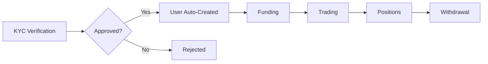
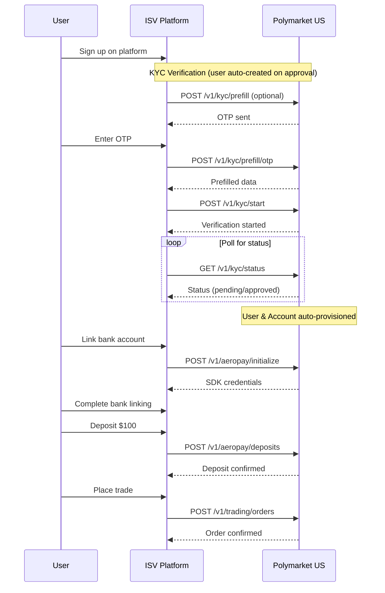

# ISV Partner Guide

This guide is for **Independent Software Vendors (ISVs)** building retail trading platforms on top of Polymarket US. If you're building a platform that onboards end-users for trading, this section is for you.

<Info>
**What is an ISV?**

An ISV (Independent Software Vendor) is a partner that builds a consumer-facing trading application. ISVs manage their own users, handle KYC verification, process deposits and withdrawals, and execute trades on behalf of their customers.
</Info>

## Before You Start

<Card title="Authentication Setup & Onboarding" icon="key" href="/getting-started/authentication">
  Generate your API keys, share your public key with Polymarket, and get your credentials. Includes code examples for Python, Go, and cURL.
</Card>

## Partner Types

Polymarket US supports two types of partners:

| Partner Type | Description | APIs Used |
|--------------|-------------|-----------|
| **Direct Trading** | Institutional or proprietary traders who trade their own capital | Trading APIs only |
| **ISV Partner** | Retail platforms onboarding end-users | Trading APIs + ISV Partner APIs |

## User Lifecycle

ISV partners manage the complete user lifecycle from KYC verification to trading:

<Info>
**Automatic User Creation**

Users are created automatically when KYC verification is approved. There is no separate account creation step - the system provisions EP3 trading resources as part of the KYC approval process.
</Info>

### 1. Identity Verification (KYC)

Start by verifying user identity. When approved, the user is automatically provisioned for trading.

- **API**: [KYC API](/isv-partners/kyc/overview)
- **Key endpoint**: `POST /v1/kyc/start`

### 2. Funding

Link bank accounts or cards and process deposits.

- **API**: [Payments API](/isv-partners/payments/overview)
- **Guides**: [Aeropay (ACH)](/isv-partners/payments/aeropay-guide) | [Checkout (Cards)](/isv-partners/payments/checkout-guide)
- **Key endpoints**:
  - `POST /v1/aeropay/initialize` - Link bank account
  - `POST /v1/checkout/deposits` - Process card deposit

### 3. Trading

Once funded, users can place orders.

- **API**: [Trading API](/api-reference/trading/overview)
- **Key endpoints**:
  - `POST /v1/trading/orders` - Insert order
  - `POST /v1/trading/orders/cancel` - Cancel order

### 4. Positions & Withdrawals

Track positions and process withdrawals (following FIFO rules).

- **API**: [Positions API](/api-reference/positions/overview) | [Funding Management](/isv-partners/payments/funding-management)
- **Key endpoints**:
  - `GET /v1/positions` - Get positions
  - `POST /v1/aeropay/withdrawals` - Process withdrawal

## Complete Onboarding Flow

## Getting Started

<CardGroup cols={2}>
  <Card title="Users API" icon="user" href="/isv-partners/users">
    List and manage users
  </Card>
  <Card title="KYC Verification" icon="id-card" href="/isv-partners/kyc/overview">
    Identity verification workflow
  </Card>
  <Card title="Payments" icon="credit-card" href="/isv-partners/payments/overview">
    Bank and card payment processing
  </Card>
  <Card title="Referral Codes" icon="ticket" href="/isv-partners/kyc/referral-codes">
    Track user acquisition
  </Card>
</CardGroup>

## Support

For ISV integration questions, contact [fixapi@polymarket.com](mailto:fixapi@polymarket.com).
