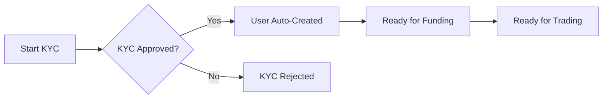

# Users API

The Users API provides user management capabilities for partners. Users represent individual retail traders on your platform.

<Info>
**Automatic User Creation**

Users are created automatically when their KYC verification is approved. You do not need to call a user creation endpoint manually. See [KYC Verification Flow](/isv-partners/kyc/verification-flow) for details.
</Info>

## Endpoints

| Method | Endpoint | Description |
|--------|----------|-------------|
| `GET` | `/v1/users` | List users for trading |
| `GET` | `/v1/whoami` | Get current authenticated identity |

## User Lifecycle



When a user completes KYC verification and is approved:
1. The system automatically provisions an EP3 participant
2. A trading account is created for the user
3. The user can immediately proceed to funding and trading

## List Users

Returns the users that the caller may trade on behalf of.

### Request

```bash
GET /v1/users
```

### Response

```json
{
  "users": [
    "firms/ISV-Participant-Acme/users/user-123",
    "firms/ISV-Participant-Acme/users/user-456"
  ],
  "displayNames": [
    "John Doe",
    "Jane Smith"
  ],
  "firms": [
    "ISV-Participant-Acme",
    "ISV-Participant-Acme"
  ],
  "firmsDisplayNames": [
    "Acme Trading",
    "Acme Trading"
  ]
}
```

### Response Fields

| Field | Type | Description |
|-------|------|-------------|
| `users` | array | EP3 participant IDs for each user |
| `displayNames` | array | Human-readable names (parallel array) |
| `firms` | array | Firm IDs the users belong to |
| `firmsDisplayNames` | array | Human-readable firm names |

## Get Who Am I

Returns identity information for the authenticated caller.

### Request

```bash
GET /v1/whoami
```

### Response

```json
{
  "user": "firms/ISV-Participant-Acme/users/admin",
  "userDisplayName": "ISV Admin",
  "firm": "ISV-Participant-Acme",
  "firmDisplayName": "Acme Trading Platform",
  "audience": "https://api.preprod.polymarketexchange.com",
  "firmType": "FIRM_TYPE_PARTICIPANT"
}
```

### Response Fields

| Field | Type | Description |
|-------|------|-------------|
| `user` | string | Full EP3 participant ID |
| `userDisplayName` | string | Human-readable user name |
| `firm` | string | Firm identifier |
| `firmDisplayName` | string | Human-readable firm name |
| `audience` | string | API audience from token |
| `firmType` | enum | Type of firm (see below) |

### Firm Types

| Type | Description |
|------|-------------|
| `FIRM_TYPE_PARTICIPANT` | Standard trading participant |
| `FIRM_TYPE_SUPERVISOR` | Supervisory role |
| `FIRM_TYPE_CLEARING_MEMBER` | Clearing member |
| `FIRM_TYPE_CLEARING_HOUSE` | Clearing house |
| `FIRM_TYPE_AGENT` | Agent firm |

## User vs Account

| Entity | Description |
|--------|-------------|
| **User** | A person with identity (KYC verified). Has an EP3 participant ID. |
| **Account** | A trading account with balances and positions. Belongs to a user. |

A user can have multiple accounts for different purposes (e.g., separate trading strategies).

## Related APIs

- [KYC Verification](/isv-partners/kyc/overview) - Identity verification (creates users automatically)
- [Accounts API](/isv-partners/accounts) - List trading accounts
- [Positions API](/api-reference/positions/overview) - Check balances and positions
