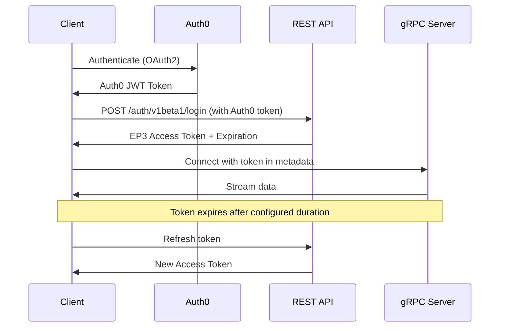

# Authentication

The Polymarket Exchange API uses **JWT (JSON Web Token)** authentication. Tokens are obtained through Auth0 and then exchanged for EP3 session tokens.

## Authentication Architecture



## Step 1: Obtain Auth0 Token

First, authenticate with Auth0 to obtain an initial JWT token. Contact support for your Auth0 credentials and configuration.

## Step 2: Exchange for EP3 Token

Exchange your Auth0 token for an EP3 session token via the REST API.

### Login Request

```curl
curl "https://traderapi.us-east-1.privatelink.preprod.polymarketexchange.com/auth/v1beta1/login" \
  -H "Host: rest.preprod.polymarketexchange.com" \
  -H "accept: application/json" \
  -H "content-type: application/json" \
  -H "Authorization: Bearer YOUR_AUTH0_TOKEN"
```

### Login Response

```json
{
  "access_token": "eyJhbGciOiJIUzI1NiIsInR5cCI6IkpXVCJ9...",
  "refresh_token": "eyJhbGciOiJIUzI1NiIsInR5cCI6IkpXVCJ9...",
  "access_expiration_time": "2025-01-18T12:00:00Z",
  "refresh_expiration_time": "2025-01-19T12:00:00Z"
}
```

<Info>
**Token Fields:**
- `access_token`: Use this for API authentication
- `refresh_token`: Use this to obtain a new access token before expiration
- `access_expiration_time`: When the access token expires
- `refresh_expiration_time`: When the refresh token expires
</Info>

## Step 3: Attach Token to gRPC Metadata

Once you have the access token, include it in the **gRPC metadata** for every streaming connection.

```python
import grpc
from connamara.ep3.v1beta1 import market_data_pb2_grpc

# Create secure channel
credentials = grpc.ssl_channel_credentials()
channel = grpc.secure_channel('traderapi.us-east-1.privatelink.preprod.polymarketexchange.com:443', credentials)

# Create stub
stub = market_data_pb2_grpc.MarketDataSubscriptionAPIStub(channel)

# Create metadata with authorization token
metadata = [
    ('authorization', access_token)
]

# Make streaming call with metadata
response_stream = stub.CreateMarketDataSubscription(request, metadata=metadata)
```

<Warning>
The metadata key **must** be `authorization` (lowercase). The value is the raw JWT token string.
</Warning>


## Handling Authentication Errors

### Common Authentication Errors

| Error Code | Description | Solution |
|------------|-------------|----------|
| `UNAUTHENTICATED` | Token is invalid or missing | Verify token in metadata, re-login if expired |
| `PERMISSION_DENIED` | Token is valid but lacks permissions | Check user permissions with support |
| `UNAVAILABLE` | Cannot reach authentication service | Check network connectivity, retry with backoff |


## Next Steps

<CardGroup cols={2}>
  <Card title="Market Data Streaming" icon="chart-line" href="/streaming-endpoints/market-data-stream">
    Learn how to stream market data
  </Card>
  <Card title="Order Streaming" icon="file-invoice" href="/streaming-endpoints/order-stream">
    Subscribe to order updates
  </Card>
  <Card title="Error Handling" icon="triangle-exclamation" href="/streaming-endpoints/error-handling">
    Handle errors and implement reconnection
  </Card>
  <Card title="Code Examples" icon="code" href="/streaming-endpoints/code-examples">
    See complete working examples
  </Card>
</CardGroup>
