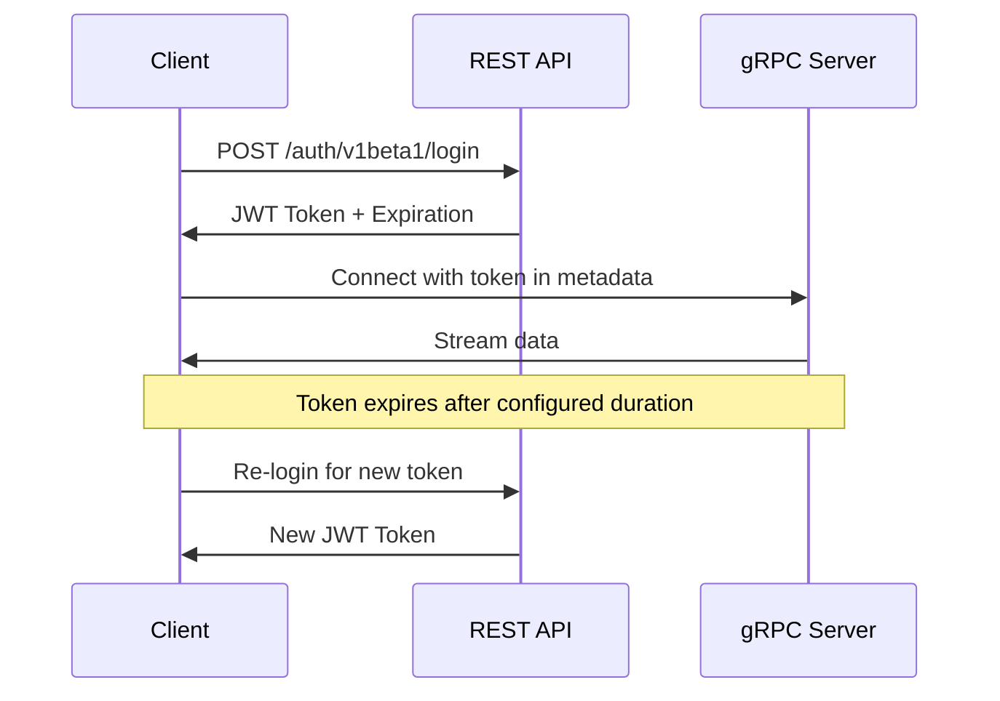

# Authentication for gRPC Streaming

gRPC streaming connections use **JWT (JSON Web Token)** authentication obtained from the REST API. This guide explains the complete authentication flow using Python.

## Authentication Architecture



## Step 1: Obtain JWT Token from REST API

Before establishing any gRPC streaming connection, you must first authenticate via the REST API.

### Login Request

```python
import requests
from datetime import datetime

def login(username: str, password: str) -> dict:
    """Authenticate and return token data."""
    url = "https://rest.staging.polymarket.us/auth/v1beta1/login"
    headers = {
        "accept": "application/json",
        "Content-Type": "application/json"
    }
    data = {
        "username": username,
        "password": password
    }

    response = requests.post(url, headers=headers, json=data)
    response.raise_for_status()

    token_data = response.json()

    # Parse expiration time
    access_expiration = datetime.fromisoformat(
        token_data["access_expiration_time"].replace("Z", "+00:00")
    )

    return {
        "access_token": token_data["access_token"],
        "refresh_token": token_data["refresh_token"],
        "expiration": access_expiration
    }

# Usage
credentials = login("your_username", "your_password")
access_token = credentials["access_token"]
```

### Login Response

```json
{
  "access_token": "eyJhbGciOiJIUzI1NiIsInR5cCI6IkpXVCJ9...",
  "refresh_token": "eyJhbGciOiJIUzI1NiIsInR5cCI6IkpXVCJ9...",
  "access_expiration_time": "2025-01-18T12:00:00Z",
  "refresh_expiration_time": "2025-01-19T12:00:00Z"
}
```

<Info>
**Token Fields:**
- `access_token`: Use this for gRPC authentication
- `refresh_token`: Use this to obtain a new access token before expiration
- `access_expiration_time`: When the access token expires
- `refresh_expiration_time`: When the refresh token expires
</Info>

## Step 2: Attach Token to gRPC Metadata

Once you have the access token, include it in the **gRPC metadata** for every streaming connection.

```python
import grpc
from connamara.ep3.v1beta1 import market_data_pb2_grpc

# Create secure channel
credentials = grpc.ssl_channel_credentials()
channel = grpc.secure_channel('traderapi.staging.polymarket.us:443', credentials)

# Create stub
stub = market_data_pb2_grpc.MarketDataSubscriptionAPIStub(channel)

# Create metadata with authorization token
metadata = [
    ('authorization', access_token)
]

# Make streaming call with metadata
response_stream = stub.CreateMarketDataSubscription(request, metadata=metadata)
```

<Warning>
The metadata key **must** be `authorization` (lowercase). The value is the raw JWT token string.
</Warning>

## Token Expiration and Refresh

### Monitoring Token Expiration

```python
from datetime import datetime, timedelta

class TokenManager:
    def __init__(self):
        self.access_token = None
        self.refresh_token = None
        self.expiration = None

    def is_token_expiring_soon(self, minutes=5):
        """Check if token expires within specified minutes."""
        if not self.expiration:
            return True

        time_until_expiry = self.expiration - datetime.now(tz=self.expiration.tzinfo)
        return time_until_expiry < timedelta(minutes=minutes)

    def should_refresh(self):
        """Determine if token should be refreshed."""
        return self.is_token_expiring_soon(minutes=5)

# Usage
token_mgr = TokenManager()
if token_mgr.should_refresh():
    # Re-login to get new token
    pass
```

### Auto-Refreshing Client

```python
import time
from threading import Thread
from datetime import datetime

class AutoRefreshingClient:
    def __init__(self, username, password):
        self.username = username
        self.password = password
        self.access_token = None
        self.expiration = None
        self._refresh_thread = None

        # Initial login
        self._login()

        # Start auto-refresh thread
        self._start_auto_refresh()

    def _login(self):
        """Login and update token."""
        credentials = login(self.username, self.password)
        self.access_token = credentials["access_token"]
        self.expiration = credentials["expiration"]

    def _auto_refresh_loop(self):
        """Background thread to refresh token."""
        while True:
            # Calculate time until expiry
            time_until_expiry = (self.expiration - datetime.now(tz=self.expiration.tzinfo)).total_seconds()

            # Refresh 5 minutes before expiry
            sleep_time = max(time_until_expiry - 300, 0)

            time.sleep(sleep_time)
            self._login()
            print(f"Token refreshed. New expiration: {self.expiration}")

    def _start_auto_refresh(self):
        """Start background refresh thread."""
        self._refresh_thread = Thread(target=self._auto_refresh_loop, daemon=True)
        self._refresh_thread.start()

# Usage
client = AutoRefreshingClient("username", "password")
# Token will automatically refresh in background
```

## Handling Authentication Errors

### Common Authentication Errors

| Error Code | Description | Solution |
|------------|-------------|----------|
| `UNAUTHENTICATED` | Token is invalid or missing | Verify token in metadata, re-login if expired |
| `PERMISSION_DENIED` | Token is valid but lacks permissions | Check user permissions with support |
| `UNAVAILABLE` | Cannot reach authentication service | Check network connectivity, retry with backoff |

### Error Handling Example

```python
import grpc

try:
    response_stream = stub.CreateMarketDataSubscription(request, metadata=metadata)

    for response in response_stream:
        # Process response
        pass

except grpc.RpcError as e:
    if e.code() == grpc.StatusCode.UNAUTHENTICATED:
        print("Authentication failed. Token may be expired.")
        # Re-login and retry
        credentials = login(username, password)
        access_token = credentials["access_token"]
        metadata = [('authorization', access_token)]
        # Retry connection

    elif e.code() == grpc.StatusCode.PERMISSION_DENIED:
        print("Permission denied. Check account permissions.")

    else:
        print(f"gRPC error: {e.code()} - {e.details()}")
```

## Security Best Practices

### 1. Secure Token Storage

<Warning>
**Never** hardcode credentials or tokens in source code. Use environment variables or secure credential stores.
</Warning>

```python
import os

# Good: Use environment variables
username = os.getenv('POLYMARKET_USERNAME')
password = os.getenv('POLYMARKET_PASSWORD')

# Bad: Hardcoded credentials
# username = "my_username"  # DON'T DO THIS
# password = "my_password"  # DON'T DO THIS
```

### 2. Use TLS/SSL for All Connections

Always use `grpc.ssl_channel_credentials()` for encrypted connections:

```python
# Good: Secure channel
credentials = grpc.ssl_channel_credentials()
channel = grpc.secure_channel('traderapi.staging.polymarket.us:443', credentials)

# Bad: Insecure channel
# channel = grpc.insecure_channel('...')  # DON'T DO THIS IN PRODUCTION
```

### 3. Implement Token Rotation

Automatically refresh tokens before expiration to avoid service interruptions.

### 4. Log Authentication Events

Log authentication events for security auditing:

```python
import logging

logging.info(f"User {username} authenticated successfully")
logging.info(f"Token expires at {expiration}")
logging.warning(f"Authentication failed for user {username}")
```

## Complete Authentication Example

Here's a complete example from the Python examples repository:

```python
import os
import grpc
import requests
from datetime import datetime, timedelta
from typing import Optional

class AuthenticatedGRPCClient:
    def __init__(self, base_url: str, grpc_server: str):
        self.base_url = base_url
        self.grpc_server = grpc_server
        self.access_token: Optional[str] = None
        self.expiration: Optional[datetime] = None

    def login(self, username: str, password: str):
        """Authenticate and store token."""
        url = f"{self.base_url}/auth/v1beta1/login"
        response = requests.post(url, json={
            "username": username,
            "password": password
        })
        response.raise_for_status()

        token_data = response.json()
        self.access_token = token_data["access_token"]
        self.expiration = datetime.fromisoformat(
            token_data["access_expiration_time"].replace("Z", "+00:00")
        )

    def is_token_valid(self) -> bool:
        """Check if token is still valid."""
        if not self.access_token or not self.expiration:
            return False

        # Consider invalid if expires within 5 minutes
        return datetime.now(tz=self.expiration.tzinfo) < (self.expiration - timedelta(minutes=5))

    def get_metadata(self):
        """Get gRPC metadata with current token."""
        if not self.is_token_valid():
            raise ValueError("Token is invalid or expired. Please login again.")

        return [('authorization', self.access_token)]

    def create_channel(self):
        """Create authenticated gRPC channel."""
        credentials = grpc.ssl_channel_credentials()
        return grpc.secure_channel(self.grpc_server, credentials)

# Usage
client = AuthenticatedGRPCClient(
    base_url="https://rest.staging.polymarket.us",
    grpc_server="traderapi.staging.polymarket.us:443"
)

# Login
username = os.getenv('POLYMARKET_USERNAME')
password = os.getenv('POLYMARKET_PASSWORD')
client.login(username, password)

# Create authenticated channel
channel = client.create_channel()
metadata = client.get_metadata()

# Use for streaming
# stub.CreateMarketDataSubscription(request, metadata=metadata)
```

## Next Steps

<CardGroup cols={2}>
  <Card title="Market Data Streaming" icon="chart-line" href="/streaming-endpoints/market-data-stream">
    Learn how to stream market data
  </Card>
  <Card title="Order Streaming" icon="file-invoice" href="/streaming-endpoints/order-stream">
    Subscribe to order updates
  </Card>
  <Card title="Error Handling" icon="triangle-exclamation" href="/streaming-endpoints/error-handling">
    Handle errors and implement reconnection
  </Card>
  <Card title="Code Examples" icon="code" href="/streaming-endpoints/code-examples">
    See complete working examples
  </Card>
</CardGroup>
