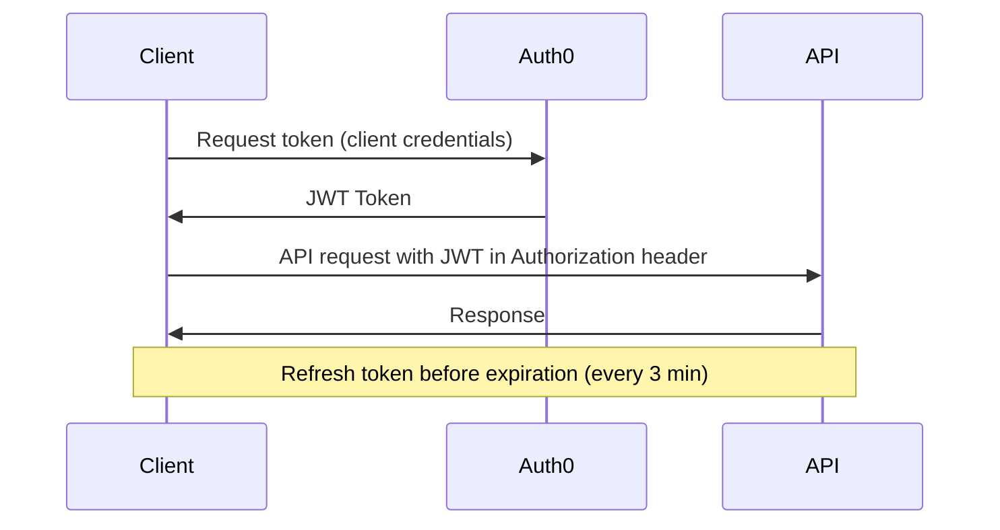

# Authentication

The Polymarket Exchange API uses **Auth0 JWT (JSON Web Token)** authentication. You obtain a token from Auth0 and include it in every API request.

<Warning>
**CRITICAL: Tokens must be refreshed every 3 minutes.**

Auth0 tokens have a short expiration. Your application MUST implement automatic token refresh before expiration to maintain uninterrupted API and streaming connections.
</Warning>

## Authentication Flow



## Auth0 Configuration

### Auth0 Tenants

| Environment | Auth0 Domain |
|-------------|--------------|
| **Production** | `pmx-prod.us.auth0.com` |
| **Preprod** | `pmx-preprod.us.auth0.com` |

Contact support for your `client_id`, `client_secret`, and `audience` values.

## Step 1: Obtain Auth0 Token

Request a JWT token from Auth0 using the OAuth 2.0 Client Credentials flow:

```bash
curl --request POST \
  --url "https://pmx-preprod.us.auth0.com/oauth/token" \
  --header "content-type: application/json" \
  --data '{
    "client_id": "YOUR_CLIENT_ID",
    "client_secret": "YOUR_CLIENT_SECRET",
    "audience": "YOUR_API_AUDIENCE",
    "grant_type": "client_credentials"
  }'
```

### Response

```json
{
  "access_token": "eyJhbGciOiJSUzI1NiIsInR5cCI6IkpXVCIs...",
  "token_type": "Bearer",
  "expires_in": 180
}
```

<Info>
The `expires_in` value is in seconds. With a 3-minute (180 second) expiration, you must refresh tokens frequently.
</Info>

## Step 2: Use Token in API Requests

Include the JWT token in the `Authorization` header for every request.

### REST API

```bash
curl "https://traderapi.us-east-1.privatelink.preprod.polymarketexchange.com/v1/accounts/whoami" \
  -H "Authorization: Bearer YOUR_JWT_TOKEN" \
  -H "accept: application/json"
```

### gRPC Streaming

Include the token in gRPC metadata:

```python
import grpc
from connamara.ep3.v1beta1 import market_data_pb2_grpc

# Create secure channel
credentials = grpc.ssl_channel_credentials()
channel = grpc.secure_channel('traderapi.us-east-1.privatelink.preprod.polymarketexchange.com:443', credentials)

# Create stub
stub = market_data_pb2_grpc.MarketDataSubscriptionAPIStub(channel)

# Include JWT in metadata
metadata = [
    ('authorization', f'Bearer {jwt_token}')
]

# Make streaming call with metadata
response_stream = stub.CreateMarketDataSubscription(request, metadata=metadata)
```

<Warning>
The metadata key **must** be `authorization` (lowercase). Include `Bearer ` prefix before the token.
</Warning>

## Token Refresh Strategy

Since tokens expire every 3 minutes, implement automatic refresh:

```python
import time
import requests
from datetime import datetime, timedelta

class TokenManager:
    def __init__(self, auth0_domain, client_id, client_secret, audience):
        self.auth0_domain = auth0_domain
        self.client_id = client_id
        self.client_secret = client_secret
        self.audience = audience
        self.token = None
        self.expires_at = None

    def get_token(self):
        # Refresh if token is missing or expires within 30 seconds
        if not self.token or datetime.now() >= self.expires_at - timedelta(seconds=30):
            self._refresh_token()
        return self.token

    def _refresh_token(self):
        response = requests.post(
            f"https://{self.auth0_domain}/oauth/token",
            json={
                "client_id": self.client_id,
                "client_secret": self.client_secret,
                "audience": self.audience,
                "grant_type": "client_credentials"
            }
        )
        response.raise_for_status()
        data = response.json()

        self.token = data["access_token"]
        self.expires_at = datetime.now() + timedelta(seconds=data["expires_in"])

# Usage
token_manager = TokenManager(
    auth0_domain="pmx-preprod.us.auth0.com",
    client_id="YOUR_CLIENT_ID",
    client_secret="YOUR_CLIENT_SECRET",
    audience="YOUR_API_AUDIENCE"
)

# Always use get_token() - it handles refresh automatically
token = token_manager.get_token()
```

## Handling Authentication Errors

### Common Authentication Errors

| Error Code | Description | Solution |
|------------|-------------|----------|
| `UNAUTHENTICATED` | Token is invalid, expired, or missing | Refresh token and retry |
| `PERMISSION_DENIED` | Token is valid but lacks required scopes | Check user permissions with support |
| `UNAVAILABLE` | Cannot reach authentication service | Check network connectivity, retry with backoff |

## Next Steps

<CardGroup cols={2}>
  <Card title="Market Data Streaming" icon="chart-line" href="/streaming-endpoints/market-data-stream">
    Learn how to stream market data
  </Card>
  <Card title="Order Streaming" icon="file-invoice" href="/streaming-endpoints/order-stream">
    Subscribe to order updates
  </Card>
  <Card title="Error Handling" icon="triangle-exclamation" href="/streaming-endpoints/error-handling">
    Handle errors and implement reconnection
  </Card>
</CardGroup>
