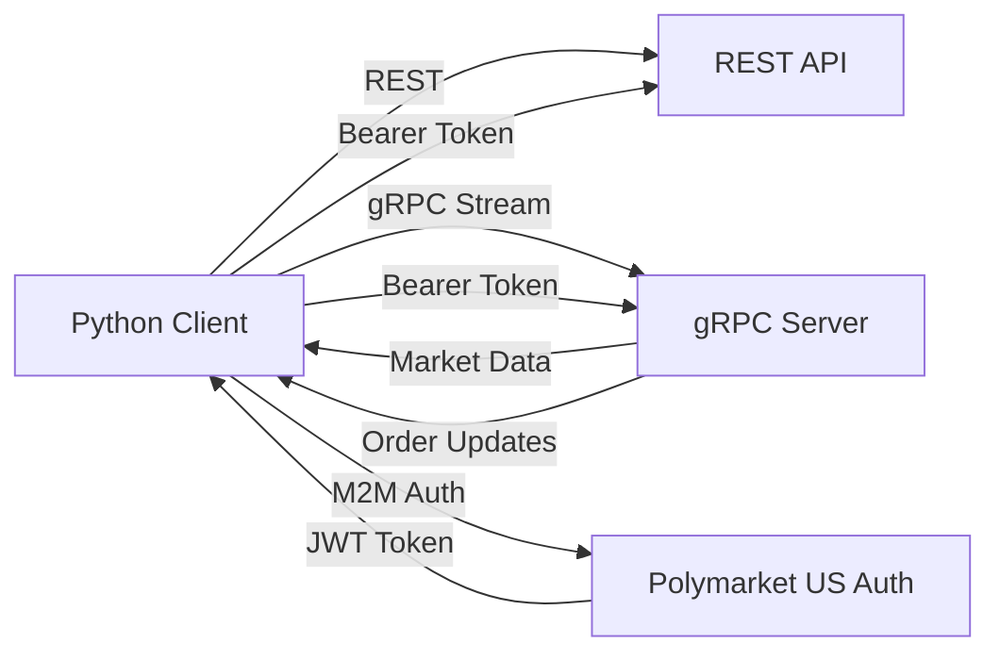

# gRPC Streaming API

The Polymarket Exchange provides **gRPC streaming services** for real-time market data and order execution updates. This enables low-latency, efficient data delivery for applications that need continuous updates.

## Why Use gRPC Streaming?

gRPC streaming offers several advantages:

- **Bidirectional Communication**: Server can push updates without client polling
- **Type Safety**: Strongly-typed messages defined in Protocol Buffers
- **Real-time Updates**: Receive market data and order updates as they happen

## REST + gRPC Hybrid Approach

<Note>
Most participants use **REST for requests** and **gRPC for streaming**. This hybrid approach combines the simplicity of REST with the efficiency of gRPC streaming.
</Note>

### Typical Integration Pattern

1. **REST API** - Used for:
   - Placing orders (`/v1/trading/orders`)
   - Canceling orders (`/v1/trading/orders/cancel`)
   - Querying account information
   - One-time data requests

2. **gRPC Streaming** - Used for:
   - Real-time market data updates
   - Live order execution reports
   - Continuous position monitoring
   - Order book changes

## Available Streaming Services

### Market Data Streaming

Subscribe to real-time market data updates including:
- Order book (bids and offers)
- Instrument state changes
- Trade statistics (last price, OHLC, volume)
- Open interest

**Service:** `MarketDataSubscriptionAPI.CreateMarketDataSubscription`

[Learn more about Market Data Streaming →](/streaming-endpoints/market-data-stream)

### Order Execution Streaming

Subscribe to real-time order and execution updates:
- New order confirmations
- Partial and complete fills
- Order cancellations and rejections
- Execution reports with trade details

**Service:** `OrderEntryAPI.CreateOrderSubscription`

[Learn more about Order Streaming →](/streaming-endpoints/order-stream)

## Server Endpoints


### Pre-Production Environment
```
grpc.api.preprod.polymarketexchange.com:443
```

### Production Environment
```
grpc.api.polymarketexchange.com:443
```

<Info>
Both endpoints use **TLS/SSL** for secure communication. All connections must be encrypted.
</Info>

## Protocol Buffer Definitions

The exchange uses **Protocol Buffers (proto3)** to define message structures. Proto files are available:

- **Upon request**: Contact [fixapi@polymarket.com](mailto:fixapi@polymarket.com)
- **Via server reflection**: Use gRPC reflection to discover services at runtime

### Package Structure

```
polymarket.v1                       # Core services
├── MarketDataSubscriptionAPI       # Market data streaming
├── OrderEntryAPI                   # Order streaming and entry
├── RefDataAPI                      # Reference data (instruments, symbols)
├── AccountsAPI                     # Account information
├── PositionAPI                     # Positions and balances
├── ReportAPI                       # Order and trade reports
├── DropCopyAPI                     # Trade execution feed
```

## Quick Start

Ready to get started? Follow our [Getting Started Guide](/streaming-endpoints/getting-started) to:

1. Install Python gRPC libraries
2. Obtain and compile proto files
3. Authenticate and connect
4. Subscribe to your first data stream

## Architecture Overview



### Authentication Flow

1. **Obtain JWT Token**: Request M2M token using client credentials
2. **Attach Token**: Include token in gRPC metadata as `authorization` header
3. **Stream Data**: Receive continuous updates over persistent connection

[Learn more about Authentication →](/streaming-endpoints/authentication)


## Rate Limits

| Limit | Value |
|-------|-------|
| Ingress (client → server) | 20 messages/sec |
| Concurrent connections | 10 per account |

<Warning>
**Ingress Rate Limit**

Client-to-server messages are limited to **20 messages per second**. This applies to requests you send, not to server-pushed updates like market data. Messages exceeding this rate may be dropped or the connection may be throttled.
</Warning>

## Key Concepts

### Heartbeats
Periodic keep-alive messages ensure connection health. If heartbeats stop, the connection may be stale.

### Snapshots
Initial state of data (e.g., all open orders) sent when subscription starts.

### Updates
Incremental changes streamed continuously after the snapshot.

### Session IDs
Unique identifiers for each streaming session, useful for logging and debugging.

## Next Steps

<CardGroup cols={2}>
  <Card title="Getting Started" icon="rocket" href="/streaming-endpoints/getting-started">
    Set up your first gRPC stream
  </Card>
  <Card title="Authentication" icon="key" href="/streaming-endpoints/authentication">
    Learn how to authenticate gRPC connections
  </Card>
  <Card title="Market Data" icon="chart-line" href="/streaming-endpoints/market-data-stream">
    Stream real-time market data
  </Card>
  <Card title="Order Updates" icon="file-invoice" href="/streaming-endpoints/order-stream">
    Subscribe to order execution updates
  </Card>
</CardGroup>
